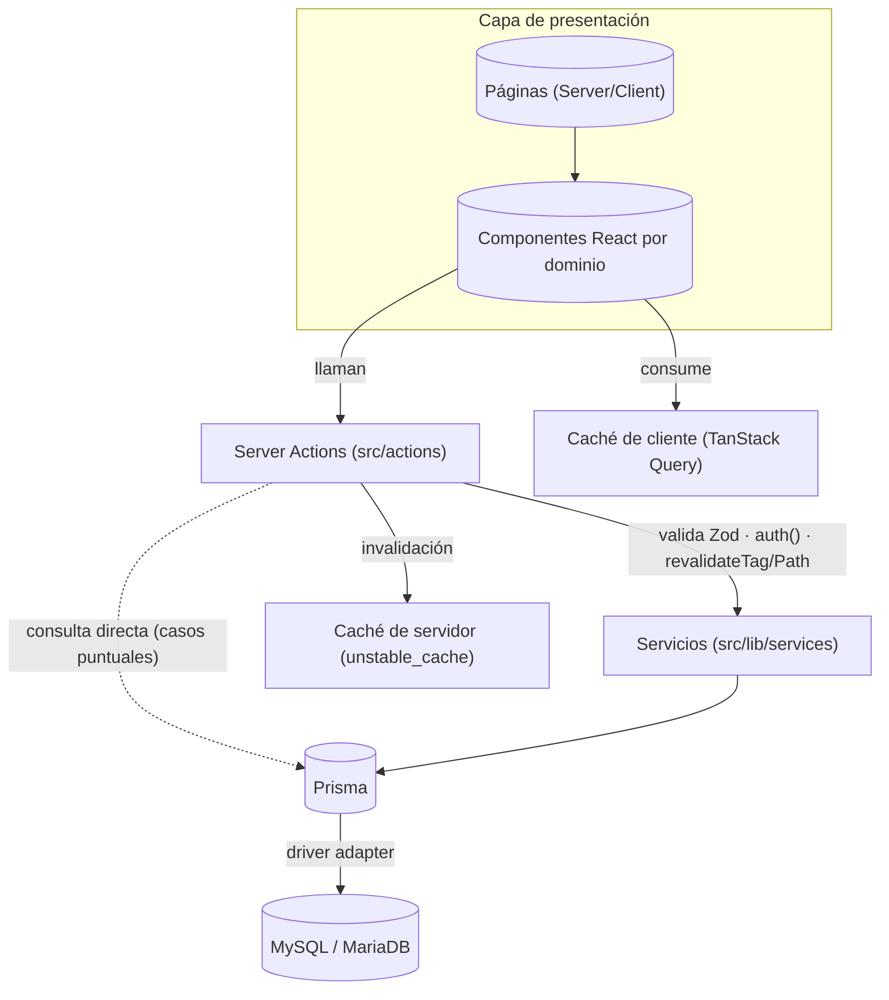
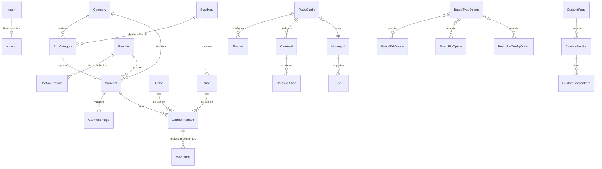
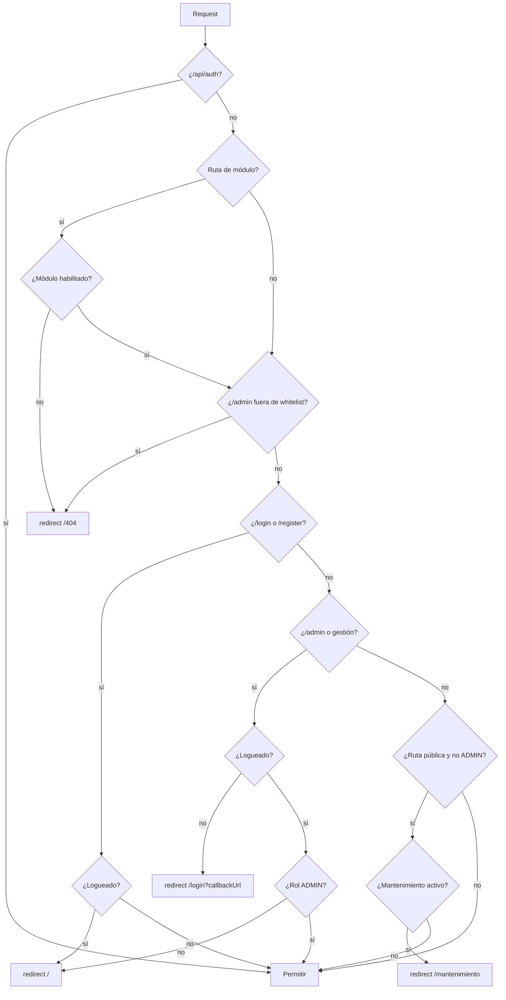
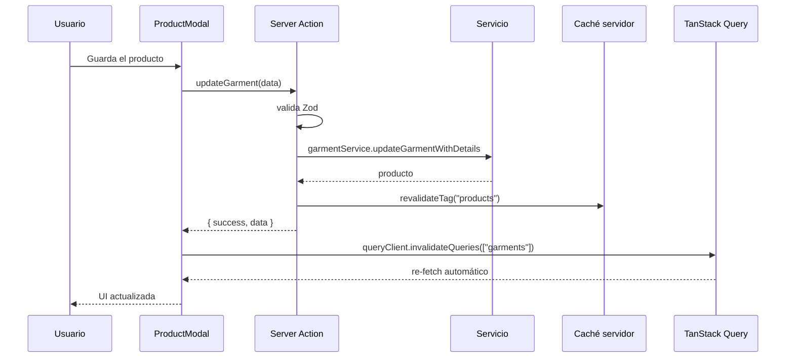
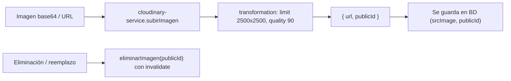
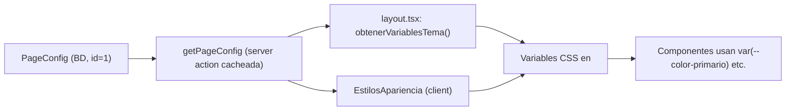

# Arquitectura — NewSurfBoard (gestion-stock)

Documento de referencia de la arquitectura **real y actual** del proyecto. Este archivo refleja el estado del código al momento de su escritura y reemplaza en vigencia a `CLAUDE.md` (desactualizado). Para las reglas de desarrollo vigentes ver `AGENTS.md`.

## Índice

0. [Arquitectura multi-tenant](#0-arquitectura-multi-tenant)
1. [Descripción general](#1-descripción-general)
2. [Stack tecnológico](#2-stack-tecnológico)
3. [Estructura de carpetas](#3-estructura-de-carpetas)
4. [Arquitectura en capas](#4-arquitectura-en-capas)
5. [Base de datos — Modelos Prisma](#5-base-de-datos--modelos-prisma)
6. [Autenticación y protección de rutas](#6-autenticación-y-protección-de-rutas)
7. [Sistema de caché](#7-sistema-de-caché)
8. [Rutas de la aplicación](#8-rutas-de-la-aplicación)
9. [Server Actions](#9-server-actions-srcactions)
10. [Servicios](#10-servicios-srclibservices)
11. [Lógica compartida](#11-lógica-compartida-srclib)
12. [Hooks, contextos, providers, tipos y helpers](#12-hooks-contextos-providers-tipos-y-helpers)
13. [Componentes por dominio](#13-componentes-por-dominio-srccomponents)
14. [Sistema de imágenes (Cloudinary)](#14-sistema-de-imágenes-cloudinary)
15. [Sistema de temas y apariencia](#15-sistema-de-temas-y-apariencia)
16. [Variables de entorno](#16-variables-de-entorno)
17. [Scripts y comandos](#17-scripts-y-comandos)
18. [Anexo: inconsistencias y deuda técnica](#18-anexo-inconsistencias-y-deuda-técnica)

---

## 0. Arquitectura multi-tenant

La aplicación opera con **una base de datos por servicio y múltiples tenants por base**, usando un único `PrismaClient` singleton y un único pool de conexiones por proceso. `Tenant` es la unidad de aislamiento lógico; el servicio es únicamente la unidad de capacidad y despliegue. La guía operativa y las reglas completas están en [`MULTI_TENANCY.md`](MULTI_TENANCY.md).

La cadena de resolución y autorización es:

```text
hostname normalizado
  -> dominio exacto o slug bajo DOMINIO_PRINCIPAL
  -> Tenant
  -> gate ACTIVO / SUSPENDIDO / INACTIVO
  -> contexto público o sesión coherente con hostname y base de datos
```

- `src/lib/tenants/` resuelve y valida el contexto del tenant. Los headers se leen fuera de Data Cache y la consulta por hostname tiene TTL corto.
- `src/lib/autenticacion/` contiene el adaptador Auth.js tenant-aware. El mismo email y la misma cuenta Google pueden existir de manera independiente en tenants distintos.
- `src/app/(tienda)/layout.tsx` aplica los gates públicos de tenant, suspensión y mantenimiento sin cambiar las URLs.
- Las Server Actions y APIs obtienen el tenant en el servidor. Los services reciben `tenantId` explícito y nunca resuelven headers, cookies ni sesión.
- Tags, query keys y claves de storage incluyen `tenantId`; las búsquedas arbitrarias no se cachean del lado servidor.
- Los assets nuevos de Cloudinary viven bajo `{tenantId}/...`; las rutas históricas siguen siendo compatibles.

`PageConfig` es uno a uno por tenant y ya no depende de un registro global `id = 1`. El middleware no usa Prisma ni self-fetches: la resolución que necesita datos ocurre en layouts, actions y route handlers del servidor.

---

## 1. Descripción general

Sistema full-stack de **gestión de inventario y e-commerce** construido sobre **Next.js 15 App Router**. El negocio es **NewSurfBoard**, una tienda de surf en Mar del Plata, Argentina. El repositorio local se llama `gestion-stock`.

El sistema tiene dos capas diferenciadas:

- **Panel de administración (ADMIN)**: inventario de productos (con variantes talle/color y stock), categorías y subcategorías, proveedores, grupos de talles, colores, movimientos de stock, carruseles, páginas dinámicas, configuración visual del sitio (identidad, colores, tipografías, estilo, estructura, contenido), módulo de tablas de surf personalizadas y gestión de usuarios.
- **Tienda pública (USER)**: home configurable por secciones, catálogo con filtros y paginación, vista de producto con variantes y pedido por WhatsApp, carrito lateral, páginas de categoría, páginas dinámicas (`/page?title=slug`), escuela de surf, plan de ahorro, taller de arreglos, configurador de tablas personalizadas y flujo legal (cookies/privacidad/términos).

Módulos activables por config (`PageConfig`): `escuelaEnabled`, `arreglosEnabled`, `personalizadoEnabled`, `planAhorroEnabled`, además del modo mantenimiento global.

---

## 2. Stack tecnológico

| Tecnología | Versión | Propósito |
|---|---|---|
| **Next.js** | 15.2.8 | Framework principal (App Router; `next dev --turbopack` en desarrollo) |
| **React** | 19.x | UI con Server y Client Components |
| **TypeScript** | 5 | Tipado estático (strict) |
| **Prisma** | 7.2 | ORM con Driver Adapter nativo para MariaDB |
| **MySQL / MariaDB** | — | Base de datos relacional (`@prisma/adapter-mariadb`) |
| **Auth.js (NextAuth)** | 5.0.0-beta.30 | Autenticación: Google OAuth + Credenciales |
| **Tailwind CSS** | 4 | Estilos (`@tailwindcss/postcss`) |
| **Zod** | 4.3.6 | Validación de esquemas en cliente y servidor |
| **Cloudinary** | 2.10 | Almacenamiento y CDN de imágenes |
| **Sonner** | 2.0.7 | Notificaciones toast |
| **Framer Motion** | 12.23 | Animaciones de UI |
| **Lucide React** | 0.562 | Iconos |
| **bcryptjs** | 3.0.3 | Hash de contraseñas |
| **TanStack React Query** | 5.100 | Caché de datos en el cliente (dashboard y catálogo) |
| **Embla Carousel** | 8.6 | Carruseles (`embla-carousel-react` + `embla-carousel-autoplay`) |
| **dnd-kit** | core/sortable/utilities | Drag & drop (orden de slides, secciones, grids) |
| **react-easy-crop** | 6.2 | Recorte de imágenes |
| **recharts** | 3.9 | Gráficos del dashboard admin |
| **class-variance-authority** + `@radix-ui/react-slot` | — | Variantes del botón |
| **cloudinary** SDK | 2.x | Subida/gestión de assets en el servidor |

---

## 3. Estructura de carpetas

```
/
├── AGENTS.md                     # Reglas de desarrollo (idioma, arquitectura, límites)
├── CLAUDE.md                     # Documentación previa (parcialmente desactualizada)
├── ARCHITECTURE.md               # Este documento
├── Configuracion_tablas_personalizadas.md  # Guía de opciones del configurador de tablas
├── PENDIENTES.md                 # Plan de optimización de rendimiento (auditoría)
├── README.md                     # Guía de instalación y puesta en marcha
├── next.config.ts                # Config de Next (unoptimized images, remotePatterns *)
├── prisma.config.ts              # Config Prisma 7 (dotenv + DATABASE_URL)
├── tsconfig.json
├── eslint.config.mjs             # ESLint 9 flat config
├── package.json
│
├── prisma/
│   ├── schema.prisma             # Esquema de base de datos (fuente de verdad)
│   └── migrations/               # Migraciones SQL
│
├── generated/prisma/             # Cliente Prisma generado — NO editar manualmente
│
├── scripts/
│   └── limpiar-enlaces-carrusel.ts   # Script de mantenimiento de enlaces de carrusel
│
└── src/
    ├── auth.ts                   # Instancia NextAuth (Google + Credentials + adapter Prisma)
    ├── auth.config.ts            # Config edge-compatible para middleware
    ├── middleware.ts             # Protección de rutas por rol y módulos
    │
    ├── app/                      # Rutas Next.js App Router (ver sección 8)
    │   ├── globals.css           # Variables CSS globales, fuentes, scrollbar
    │   └── favicon.ico
    ├── actions/                  # Server Actions por dominio (ver sección 9)
    ├── components/               # Componentes por dominio (ver sección 13)
    ├── context/ + contextos/     # Contextos React (carrito, capas)
    ├── helpers/                  # Utilidades de resolución de enlaces
    ├── hooks/                    # Hooks (TanStack Query + utilidades)
    ├── lib/                      # Lógica compartida y servicios (ver secciones 10-11)
    ├── providers/                # Proveedores globales (QueryProvider)
    └── types/                    # Tipos globales y augmentación de next-auth
```

La carpeta `src/generated` mencionada en documentaciones antiguas ya **no existe**: el cliente Prisma se genera en `/generated/prisma` (raíz del repo).

---

## 4. Arquitectura en capas

El proyecto sigue una arquitectura en capas con Server Actions como interfaz pública de negocio.



### Responsabilidad de cada capa

| Capa | Responsabilidad | Reglas |
|---|---|---|
| **UI (pages + components)** | Renderizado, interacción, estados locales. | `"use client"` solo cuando es necesario. |
| **Server Actions (`src/actions`)** | Interfaz pública de negocio: validan con Zod, autentican con `auth()`, manejan errores (`P2002`, `P2003`), llaman `revalidateTag`/`revalidatePath` y devuelven `{ success, error }` con `serializeData`. | Una acción por dominio; mutaciones invalida tags. |
| **Servicios (`src/lib/services`)** | Queries de Prisma puras, sin lógica de negocio ni validación. | Funciones puras tipadas. |
| **Prisma (`src/lib/prisma.ts`)** | Singleton de `PrismaClient` con driver adapter MariaDB y SSL automático. | Instancia global en dev. |
| **Base de datos** | MySQL/MariaDB con `relationMode = "prisma"` (relaciones simuladas, sin FKs nativas). | — |

### Por qué se separa `actions/` de `services/`

- **`actions/`**: validan, manejan errores, autentican, invalidan caché. Son la interfaz que llama cualquier componente (cliente o servidor).
- **`services/`**: solo consultas Prisma. Reutilizables y testeables.

> **Excepción verificada:** varias acciones consultan `prisma` directamente sin pasar por servicios: `search.ts`, `graficas.actions.ts`, `movements.ts`, `custom-page*.actions.ts`, `admin-personalizado.ts`, `board-options.ts`, `custom-boards.ts`, `home-config/*` y todo `page-config/*`. Esta vía directa se usa cuando la consulta es puntual, no cacheada o específica del dominio de la acción.

---

## 5. Base de datos — Modelos Prisma

### 5.1 Configuración y notas clave

| Aspecto | Detalle |
| --- | --- |
| Provider | `mysql` (MySQL/MariaDB). |
| Relation mode | `relationMode = "prisma"` — **no hay foreign keys nativas reales**; las relaciones son simuladas por Prisma Client en la capa de aplicación. |
| Generator | `prisma-client-js` con `output = "../generated/prisma"` → cliente generado en la carpeta raíz **`/generated/prisma`**. El código lo importa desde `generated/prisma/client`. |
| Config | `prisma.config.ts` usa `defineConfig` con `dotenv/config` y `datasource.url = env("DATABASE_URL")`. Esquema en `prisma/schema.prisma` y migraciones en `prisma/migrations`. |
| Conexión | `src/lib/prisma.ts` instancia `PrismaClient` con el **driver adapter `PrismaMariaDb`** (`@prisma/adapter-mariadb`). SSL automático: desactivado si `DATABASE_HOST` es `localhost`/`127.0.0.1`, activado (`rejectUnauthorized: true`) para hosts remotos. Se guarda una instancia global para evitar múltiples clientes en hot reload. |
| Registro único | **`PageConfig`** es un registro único con `id Int @default(1)`. La función `getOrCreatePageConfig()` (en `src/actions/page-config/shared/get-page-config.ts`) busca la fila con `id: 1` y, si no existe, la crea con valores por defecto; garantiza que siempre haya una fila de configuración. |

### 5.2 Modelos y relaciones



Las relaciones many-to-many `BoardTypeOption ↔ BoardTailOption`, `BoardTypeOption ↔ BoardFinOption` y `BoardTypeOption ↔ BoardFinConfigOption` se materializan en las tablas puente `_BoardFinConfigOptionToBoardTypeOption`, `_BoardFinOptionToBoardTypeOption` y `_BoardTailOptionToBoardTypeOption` (ver 5.3.27–5.3.29).

---

### 5.3 Modelos por dominio

#### Autenticación (next-auth)

**5.3.1 `user`** — Representa un usuario del sistema (cliente o administrador); alimenta el adaptador de next-auth.

| Campo | Tipo | Notas |
| --- | --- | --- |
| `id` | `String` | `@id @default(cuid())` |
| `email` | `String` | Único (`map: "User_email_key"`) |
| `password` | `String?` | Solo para auth por credenciales; `null` si usa OAuth |
| `role` | `user_role` | `@default(USER)` |
| `telefono` | `String?` | Campo de negocio |
| `emailVerified`, `image`, `name` | `String?` / `DateTime?` | Estándar de next-auth |
| `createdAt` / `updatedAt` | `DateTime` | Timestamps |

Relaciones: `account[]` (1 a muchos).

**5.3.2 `account`** — Cuenta OAuth/credencial vinculada a un usuario (modelo estándar de next-auth).

| Campo | Tipo | Notas |
| --- | --- | --- |
| `id` | `String` | `@id @default(cuid())` |
| `userId` | `String` | FK a `user`, `onDelete: Cascade` |
| `provider` / `providerAccountId` | `String` | Único compuesto `@@unique([provider, providerAccountId])` |
| `type`, `token_type`, `scope`, `session_state` | `String?` | Metadatos OAuth |
| `expires_at` | `Int?` | Caducidad del token |
| `refresh_token`, `access_token`, `id_token` | `String? @db.Text` | Tokens |

Relaciones: `user` (N:1). Índices: `@@index([userId])`.

#### Catálogo

**5.3.3 `Category`** — Categoría principal de productos.

| Campo | Tipo | Notas |
| --- | --- | --- |
| `id` | `String` | `@id @default(cuid())` |
| `name` | `String` | Único |
| `active` | `Boolean` | `@default(true)` |
| `createdAt` / `updatedAt` | `DateTime` | Timestamps |

Relaciones: `subCategories[]`, `garments[]`.

**5.3.4 `SubCategory`** — Subcategoría dentro de una categoría, opcionalmente ligada a un tipo de talles.

| Campo | Tipo | Notas |
| --- | --- | --- |
| `id` | `String` | `@id @default(cuid())` |
| `name` | `String` | Único compuesto `@@unique([name, categoryId])` |
| `categoryId` | `String` | FK a `Category` |
| `sizeTypeId` | `String?` | FK opcional a `SizeType` |
| `active` | `Boolean` | `@default(true)` |
| `createdAt` / `updatedAt` | `DateTime` | Timestamps |

Relaciones: `category` (N:1), `sizeType` (N:1 opcional), `garments[]`. Índices: `categoryId`, `sizeTypeId`.

**5.3.5 `Garment`** — Producto (prenda) del catálogo.

| Campo | Tipo | Notas |
| --- | --- | --- |
| `id` | `String` | `@id @default(cuid())` |
| `name` | `String` | Nombre del producto |
| `price` / `cost` | `Decimal(10, 2)` | Obligatorios |
| `maxPrice` | `Decimal(10, 2)?` | Precio máximo (rango) |
| `description` | `String? @db.Text` | Descripción |
| `active` | `Boolean` | `@default(true)` |
| `categoryId` | `String` | FK a `Category` |
| `subCategoryId` | `String?` | FK opcional a `SubCategory` |
| `supplierId` | `String?` | FK opcional a `Provider` |

Relaciones: `category` (N:1), `subCategory` (N:1 opcional), `supplier` (N:1 opcional → `Provider`), `variants[]`, `images[]`. Índices: `categoryId`, `[categoryId, createdAt]`, `[subCategoryId, createdAt]`, `subCategoryId`, `supplierId`.

**5.3.6 `GarmentImage`** — Imagen de un producto (almacenada típicamente en Cloudinary).

| Campo | Tipo | Notas |
| --- | --- | --- |
| `id` | `String` | `@id @default(cuid())` |
| `srcImage` | `String @db.Text` | URL de la imagen |
| `publicId` | `String? @db.Text` | ID en Cloudinary |
| `order` | `Int` | `@default(0)` — orden de visualización |
| `alt` | `String?` | Texto alternativo |
| `garmentId` | `String` | FK a `Garment`, `onDelete: Cascade` |

Relaciones: `garment` (N:1). Índices: `garmentId`.

**5.3.7 `GarmentVariant`** — Variante de un producto por talle y color, con stock y SKU.

| Campo | Tipo | Notas |
| --- | --- | --- |
| `id` | `String` | `@id @default(cuid())` |
| `sku` | `String?` | Único |
| `stock` | `Int` | `@default(0)` |
| `garmentId` | `String` | FK a `Garment`, `onDelete: Cascade` |
| `sizeId` | `String?` | FK opcional a `Size` |
| `colorId` | `String?` | FK opcional a `Color` |
| `attributes` | `Json?` | Atributos extra (ej. talles custom de tablas) |

Relaciones: `garment` (N:1), `size` (N:1 opcional), `color` (N:1 opcional), `movements[]`. Único compuesto: `@@unique([garmentId, sizeId, colorId])`. Índices: `garmentId`, `sizeId`, `colorId`.

#### Talles y colores

**5.3.8 `SizeType`** — Tipo de talles (ej. "Letra", "Numérico", "Tabla").

| Campo | Tipo | Notas |
| --- | --- | --- |
| `id` | `String` | `@id @default(cuid())` |
| `name` | `String` | Único |
| `active` | `Boolean` | `@default(true)` |

Relaciones: `sizes[]`, `subCategories[]` (subcategorías cuyo tallado define).

**5.3.9 `Size`** — Valor de talle perteneciente a un `SizeType`.

| Campo | Tipo | Notas |
| --- | --- | --- |
| `id` | `String` | `@id @default(cuid())` |
| `value` | `String` | Único compuesto `@@unique([value, sizeTypeId])` |
| `sizeTypeId` | `String` | FK a `SizeType` |
| `order` | `Int` | `@default(0)` — orden en el tipo |
| `active` | `Boolean` | `@default(true)` |

Relaciones: `sizeType` (N:1), `variants[]`. Índices: `sizeTypeId`.

**5.3.10 `Color`** — Color de producto.

| Campo | Tipo | Notas |
| --- | --- | --- |
| `id` | `String` | `@id @default(cuid())` |
| `name` | `String` | Único |
| `hex` | `String?` | Valor hexadecimal |
| `active` | `Boolean` | `@default(true)` |

Relaciones: `variants[]`.

#### Proveedores y movimientos

**5.3.11 `Provider`** — Proveedor de productos.

| Campo | Tipo | Notas |
| --- | --- | --- |
| `id` | `String` | `@id @default(cuid())` |
| `name` | `String` | Único |
| `details` | `String?` | Detalles/notas |
| `active` | `Boolean` | `@default(true)` |
| `createdAt` / `updatedAt` | `DateTime` | Timestamps |

Relaciones: `contacts[]`, `garments[]`.

**5.3.12 `ContactProvider`** — Medio de contacto (teléfono, mail, etc.) de un proveedor.

| Campo | Tipo | Notas |
| --- | --- | --- |
| `id` | `String` | `@id @default(cuid())` |
| `contact` | `String` | Valor del contacto |
| `type` | `String` | Tipo de contacto (EMAIL/PHONE) |
| `idProvider` | `String` | FK a `Provider`, `onDelete: Cascade` |
| `active` | `Boolean` | `@default(true)` |

Relaciones: `provider` (N:1). Único compuesto: `@@unique([contact, idProvider])`. Índices: `idProvider`.

**5.3.13 `Movement`** — Movimiento de stock (entrada/salida) sobre una variante.

| Campo | Tipo | Notas |
| --- | --- | --- |
| `id` | `String` | `@id @default(cuid())` |
| `type` | `MovementType` | `IN` (entrada) / `OUT` (salida) |
| `quantity` | `Int` | Cantidad movida |
| `priceAtTime` | `Decimal(10, 2)` | Precio en el momento |
| `note` | `String?` | Nota del movimiento |
| `variantId` | `String` | FK a `GarmentVariant`, `onDelete: Cascade` |
| `createdAt` | `DateTime` | `@default(now())` |

Relaciones: `garmentVariant` (N:1). Índices: `variantId`, `[type, createdAt]`.

#### Configuración del sitio

**5.3.14 `PageConfig`** — Configuración global de la tienda; **registro único con `id: 1`**.

| Campo | Tipo | Notas |
| --- | --- | --- |
| `id` | `Int` | `@id @default(1)` — registro único |
| `storeName`, `description`, `slogan`, `logo`, `favicon` | `String?` / `String` | Identidad de la marca |
| `primaryColor` / `secondaryColor` / `bgColor` | `String?` | Defaults `#06b6d4` / `#FFFFFF` / `#09090b` |
| `ecommerceEnabled`, `cartEnabled`, `checkoutEnabled`, `maintenanceMode` | `Boolean` | Flags de funcionamiento |
| `phone`, `whatsapp`, `email` | `String?` | Contacto |
| `locationEnabled`, `address`, `city`, `province`, `country`, `postalCode`, `mapsUrl` | `Boolean` / `String?` | Ubicación |
| `instagram`, `facebook`, `tiktok`, `x`, `youtube`, `linkedin` | `String? @db.Text` | Redes sociales |
| `currency` / `language` | `String` | Defaults `"ARS"` / `"es"` |
| `metaTitle`, `metaDescription` | `String?` | SEO |
| `termsAndConditions`, `privacyPolicy` | `String? @db.Text` | Legales |
| `featuredLayout` | `PageConfig_featuredLayout` | `@default(GRID)` |
| `homegridId` | `String?` | FK opcional a `Homegrid` |
| `arreglosEnabled`, `escuelaEnabled`, `personalizadoEnabled`, `planAhorroEnabled` | `Boolean` | Módulos habilitados |
| `footerAboutText`, `footerCopyrightText`, `footerShow*` | `String?` / `Boolean` | Pie de página |
| `sectionOrder` | `String` | Orden JSON de secciones (default `"[\"hero\",\"banner\",\"featured\",\"cards\",\"location\"]"`) |
| `fontPrimary`, `fontSecondary`, `borderRadius`, `shadowLevel`, `density` | `String` | Estilo visual (defaults `"Outfit"`, `"Playfair Display"`, `"redondeado"`, `"sutil"`, `"comoda"`) |

Relaciones: `banners[]`, `carousels[]`, `homegrid` (N:1 opcional vía `homegridId`). La función `getOrCreatePageConfig()` garantiza que la fila `id: 1` siempre exista.

**5.3.15 `Banner`** — Banner de la home vinculado a la configuración del sitio.

| Campo | Tipo | Notas |
| --- | --- | --- |
| `id` | `Int` | `@id @default(autoincrement())` |
| `order` | `Int` | Único compuesto `@@unique([pageConfigId, order])` |
| `image`, `url` | `String? @db.Text` | Imagen y enlace |
| `title`, `subtitle`, `text` | `String?` | Contenido |
| `pageConfigId` | `Int` | FK a `PageConfig`, `onDelete: Cascade` |

Relaciones: `pageConfig` (N:1).

**5.3.16 `Carousel`** — Carrusel de la home tipificado por `CarouselType`.

| Campo | Tipo | Notas |
| --- | --- | --- |
| `id` | `String` | `@id @default(cuid())` |
| `type` | `CarouselType` | `HERO` / `BANNER` / `CARDS` |
| `title` | `String?` | Título de sección (solo CARDS/BANNER) |
| `order` | `Int` | Único compuesto `@@unique([pageConfigId, order])` |
| `active` | `Boolean` | `@default(true)` |
| `settings` | `Json?` | Config específica por tipo |
| `pageConfigId` | `Int` | FK a `PageConfig`, `onDelete: Cascade` |

Relaciones: `pageConfig` (N:1), `slides[]`.

**5.3.17 `CarouselSlide`** — Slide individual dentro de un carrusel.

| Campo | Tipo | Notas |
| --- | --- | --- |
| `id` | `String` | `@id @default(cuid())` |
| `carouselId` | `String` | FK a `Carousel`, `onDelete: Cascade` |
| `order` | `Int` | Único compuesto `@@unique([carouselId, order])` |
| `image`, `publicId`, `url` | `String? @db.Text` | Media y enlace |
| `title`, `subtitle`, `description`, `ctaText` | `String?` | Contenido (cta = texto del botón) |
| `config` | `Json?` | Config por slide (layout del Hero, etc.) |

Relaciones: `carousel` (N:1).

**5.3.18 `Homegrid`** — Grilla de tarjetas de la home.

| Campo | Tipo | Notas |
| --- | --- | --- |
| `id` | `String` | `@id @default(cuid())` |
| `title`, `subtitle` | `String` | Títulos |
| `style` | `Int` | Variante de estilo |
| `columns` | `String` | Clases de columnas (default `"md:grid-cols-2"`) |
| `active` | `Boolean` | `@default(true)` |

Relaciones: `grids[]`, `pageConfigs[]`.

**5.3.19 `Grid`** — Tarjeta individual dentro de una `Homegrid`.

| Campo | Tipo | Notas |
| --- | --- | --- |
| `id` | `String` | `@id @default(cuid())` |
| `title`, `subtitle`, `image` | `String` | Contenido de la tarjeta |
| `homegridId` | `String` | FK a `Homegrid`, `onDelete: Cascade` |
| `order` | `Int` | `@default(0)` |
| `linkType` | `GridLinkType` | `@default(NONE)` — destino del enlace |
| `linkValue` | `String?` | Valor del enlace |
| `subtitleNeon`, `subtitleDim` | `Boolean` | Efectos del subtítulo |
| `linkStyle` | `LinkStyle` | `@default(IMAGE)` — enlace como imagen o botón |
| `buttonVariant` | `ButtonVariant` | `@default(DEFAULT)` |
| `buttonText`, `buttonBgColor`, `buttonTextColor` | `String?` | Estilo del botón |

Relaciones: `homegrid` (N:1). Índices: `homegridId`.

#### Tablas personalizadas (encargos de tablas de surf)

**5.3.20 `CustomBoard`** — Pedido/encargo de tabla de surf personalizada (datos del formulario).

| Campo | Tipo | Notas |
| --- | --- | --- |
| `id` | `String` | `@id @default(cuid())` |
| `tipo`, `material`, `cola`, `killaTipo`, `killaCount` | `String` | Especificaciones de la tabla |
| `largo`, `ancho`, `espesor` | `String` | Medidas |
| `volumen` | `String?` | Volumen |
| `notas` | `String? @db.Text` | Notas del cliente |
| `deliveryOption` | `String?` | Opción de entrega elegida |

Sin relaciones con otras tablas.

**5.3.21 `BoardTypeOption`** — Tipo de tabla de surf disponible para personalizar.

| Campo | Tipo | Notas |
| --- | --- | --- |
| `id` | `String` | `@id @default(cuid())` |
| `name` | `String` | Único |
| `svgPath` | `String? @db.Text` | Vector para UI |
| `active` | `Boolean` | `@default(true)` |

Relaciones M:N: `allowedTails` (`BoardTailOption`), `allowedFins` (`BoardFinOption`), `allowedConfigs` (`BoardFinConfigOption`).

**5.3.22 `BoardMaterialOption`** — Material constructivo de la tabla.

| Campo | Tipo | Notas |
| --- | --- | --- |
| `id` | `String` | `@id @default(cuid())` |
| `name` | `String` | Único |
| `description` | `String?` | Descripción |
| `active` | `Boolean` | `@default(true)` |

Sin relaciones.

**5.3.23 `BoardTailOption`** — Forma de cola (tail) de la tabla.

| Campo | Tipo | Notas |
| --- | --- | --- |
| `id` | `String` | `@id @default(cuid())` |
| `name` | `String` | Único |
| `svgPath` | `String? @db.Text` | Vector para UI |
| `active` | `Boolean` | `@default(true)` |

Relación M:N: `boardTypes` (`BoardTypeOption`).

**5.3.24 `BoardFinOption`** — Tipo/configuración simple de quilla (fin).

| Campo | Tipo | Notas |
| --- | --- | --- |
| `id` | `String` | `@id @default(cuid())` |
| `name` | `String` | Único |
| `active` | `Boolean` | `@default(true)` |

Relación M:N: `boardTypes` (`BoardTypeOption`).

**5.3.25 `BoardFinConfigOption`** — Configuración de quillas con cantidad de aletas.

| Campo | Tipo | Notas |
| --- | --- | --- |
| `id` | `String` | `@id @default(cuid())` |
| `name` | `String` | Único |
| `count` | `Int` | Cantidad de aletas |
| `active` | `Boolean` | `@default(true)` |

Relación M:N: `boardTypes` (`BoardTypeOption`).

**5.3.26 `BoardDeliveryOption`** — Opción de entrega para tablas personalizadas.

| Campo | Tipo | Notas |
| --- | --- | --- |
| `id` | `String` | `@id @default(cuid())` |
| `label` | `String` | Único |
| `description` | `String?` | Descripción |
| `active` | `Boolean` | `@default(true)` |
| `createdAt` / `updatedAt` | `DateTime` | Timestamps |

Sin relaciones.

**5.3.27 `BoardFinConfigOptionToBoardTypeOption`** — Modelo puente generado por Prisma (mapeado con `@@map` a la tabla física `_BoardFinConfigOptionToBoardTypeOption`) para la relación M:N `BoardTypeOption ↔ BoardFinConfigOption`.

| Campo | Tipo | Notas |
| --- | --- | --- |
| `A` / `B` | `String` | FKs de ambos extremos; `@@unique([A, B])`, `@@index([B])` |

Mapeada a `_BoardFinConfigOptionToBoardTypeOption`.

**5.3.28 `BoardFinOptionToBoardTypeOption`** — Modelo puente generado por Prisma (mapeado con `@@map` a la tabla física `_BoardFinOptionToBoardTypeOption`) para la relación M:N `BoardTypeOption ↔ BoardFinOption`.

| Campo | Tipo | Notas |
| --- | --- | --- |
| `A` / `B` | `String` | FKs de ambos extremos; `@@unique([A, B])`, `@@index([B])` |

Mapeada a `_BoardFinOptionToBoardTypeOption`.

**5.3.29 `BoardTailOptionToBoardTypeOption`** — Modelo puente generado por Prisma (mapeado con `@@map` a la tabla física `_BoardTailOptionToBoardTypeOption`) para la relación M:N `BoardTypeOption ↔ BoardTailOption`.

| Campo | Tipo | Notas |
| --- | --- | --- |
| `A` / `B` | `String` | FKs de ambos extremos; `@@unique([A, B])`, `@@index([B])` |

Mapeada a `_BoardTailOptionToBoardTypeOption`.

#### Páginas dinámicas

**5.3.30 `CustomPage`** — Página dinámica con slug público y URL accesible (`/page?title=<slug>`).

| Campo | Tipo | Notas |
| --- | --- | --- |
| `id` | `String` | `@id @default(cuid())` |
| `slug` | `String` | Único |
| `title` | `String` | Título de la página |
| `subtitle` | `String? @db.Text` | Subtítulo |
| `isActive` | `Boolean` | `@default(true)` |

Mapeada a tabla `CustomPages`. Relaciones: `sections[]`.

**5.3.31 `CustomSection`** — Sección tipada dentro de una página dinámica.

| Campo | Tipo | Notas |
| --- | --- | --- |
| `id` | `String` | `@id @default(cuid())` |
| `pageId` | `String` | FK a `CustomPage`, `onDelete: Cascade` |
| `type` | `SectionType` | `HERO` / `TEXT` / `CARDS` / `FAQ` / `TIMELINE` / `CTA` / `GALLERY` / `FEATURES` |
| `title`, `subtitle` | `String?` | Encabezados |
| `order` | `Int` | `@default(0)` |
| `config` | `Json?` | Config de la sección |

Mapeada a tabla `CustomPageSections`. Relaciones: `page` (N:1), `items[]`. Índices: `pageId`.

**5.3.32 `CustomSectionItem`** — Item/entrada dentro de una sección (tarjeta, FAQ, timeline, etc.).

| Campo | Tipo | Notas |
| --- | --- | --- |
| `id` | `String` | `@id @default(cuid())` |
| `sectionId` | `String` | FK a `CustomSection`, `onDelete: Cascade` |
| `title` | `String` | Título del item |
| `description` | `String? @db.Text` | Descripción |
| `image`, `icon` | `String?` | Media e icono |
| `link` | `String?` | Enlace |
| `order` | `Int` | `@default(0)` |
| `config` | `Json?` | Config del item |

Mapeada a tabla `CustomPageItems`. Relaciones: `section` (N:1). Índices: `sectionId`.

---

### 5.4 Enums

| Enum | Valores | Uso |
| --- | --- | --- |
| `user_role` | `USER`, `ADMIN` | `user.role` — rol del usuario |
| `MovementType` | `IN`, `OUT` | `Movement.type` — entrada o salida de stock |
| `SectionType` | `HERO`, `TEXT`, `CARDS`, `FAQ`, `TIMELINE`, `CTA`, `GALLERY`, `FEATURES` | `CustomSection.type` — tipo de sección dinámica |
| `PageConfig_featuredLayout` | `GRID`, `COLLAGE`, `MINIMAL` | `PageConfig.featuredLayout` — layout de productos destacados |
| `CarouselType` | `HERO`, `BANNER`, `CARDS` | `Carousel.type` — variante del carrusel (Hero fullscreen, franja rotativa, grilla de tarjetas) |
| `LinkStyle` | `IMAGE`, `BUTTON` | `Grid.linkStyle` — enlace de tarjeta como imagen o botón |
| `ButtonVariant` | `DEFAULT`, `STRAIGHT`, `TRANSPARENT` | `Grid.buttonVariant` — variante visual del botón |
| `GridLinkType` | `NONE`, `CATEGORY`, `PRODUCT`, `PAGE`, `EXTERNAL` | `Grid.linkType` — destino del enlace de la tarjeta |

---

## 6. Autenticación y protección de rutas

### 6.1 Archivos involucrados

| Archivo | Propósito |
|---|---|
| `src/auth.config.ts` | Config base edge-compatible (provider Google + sesión JWT + callbacks jwt/session). |
| `src/auth.ts` | Instancia final de NextAuth: combina `authConfig` con `PrismaAdapter(prisma)` y el provider `Credentials` (valida con `loginSchema`, compara con `bcrypt.compare`). Exporta `{ handlers, auth, signIn, signOut }`. |
| `src/middleware.ts` | Instancia `auth` con `authConfig`; reglas de protección de rutas por rol y por módulos habilitados. |
| `src/app/api/auth/[...nextauth]/route.ts` | Re-exporta `GET`/`POST` de `@/auth`. Excluida del middleware. |

### 6.2 Configuración de sesión

```ts
session: {
  strategy: "jwt",
  maxAge: 24 * 60 * 60,   // 1 día
  updateAge: 60 * 60,      // refresca el token cada 1 hora de actividad
}
```

### 6.3 Callbacks JWT y Session

- **jwt**: en la primera firma copia `id`, `role`, `telefono` e `image` del usuario al token. Con `trigger === "update"` refresca `name` y `telefono` (cuando el usuario actualiza su perfil).
- **session**: si el token no tiene `id` devuelve `user: null` (token inválido/expirado); si no, puebla `session.user` con los datos del token.

Los roles se guardan en el token JWT; el acceso ADMIN se valida tanto en `middleware.ts` como en `src/app/admin/layout.tsx`.

### 6.4 Protección de rutas (middleware.ts)

El middleware ejecuta el siguiente flujo por cada request:



Reglas clave:

1. `/api/auth` siempre pasa.
2. **Rutas de módulo** (`RUTAS_MODULOS`: `/escuela`, `/arreglos`, `/personalizado`, `/admin/personalizado`, `/plan-de-ahorro`) consultan `/api/paginas-config` y redirigen a `/404` si el flag está apagado.
3. **Whitelist admin** (`RUTAS_ADMIN_VALIDAS`): cualquier `/admin*` fuera de la lista exacta redirige a `/404`.
4. Rutas de auth (`/login`, `/register`): con sesión → redirige a `/`; sin sesión → pasa.
5. Rutas admin y de gestión (`/admin*`, `/dashboard`, `/provider`, `/sizes`, `/movements`): sin login → `/login?callbackUrl=…`; rol `USER` → `/`.
6. **Rutas públicas**: si no es ADMIN y el modo mantenimiento está activo (consulta `/api/mantenimiento`) → redirige a `/mantenimiento`.

**Matcher** (config de `middleware.ts`): excluye `_next/static`, `_next/image`, `favicon.ico` y archivos con extensión estática.

### 6.5 Funciones auxiliares

| Función | Archivo | Descripción |
|---|---|---|
| `moduloHabilitado(clave)` | `src/lib/modulos/modulo-habilitado.ts` | Lee el flag del módulo en `pageConfig` (id=1). |
| `verificarModuloHabilitado(clave)` | `src/lib/modulos/verificar-modulo.ts` | Llama `notFound()` si el módulo está deshabilitado (usada en layouts/páginas de módulos). |
| `consultarModulosActivos(origin)` | `src/lib/modulos/consultar-modulos.ts` | `fetch` a `/api/paginas-config` con `no-store`. |
| `consultarMantenimientoActivo(origin)` | `src/lib/mantenimiento/consultar-mantenimiento.ts` | `fetch` a `/api/mantenimiento` con `no-store`. |

---

## 7. Sistema de caché

El proyecto usa **dos capas de caché independientes** que conviven.

### 7.1 Capa de servidor: `unstable_cache` (src/lib/cache.ts)

Cachea las queries de Prisma en el servidor. Entradas:

| Exportación | Clave | Envuelve | Revalidate | Tags |
|---|---|---|---|---|
| `getCachedProducts` | `products` | `garmentService.getGarmentsPaginated` | 300 s | `products` |
| `getCachedProductById` | `product-detail-{id}` | `garmentService.getGarmentById` | 300 s | `product-{id}` |
| `getCachedCategories` | `all-categories` | `categoryService.getCategoriesFull` | 3600 s | `categories` |
| `getCachedProviders` | `all-providers` | `providerService.getProviders` | 3600 s | `providers` |
| `getCachedSizeTypes` | `all-size-types` | `sizeService.getSizeTypes` | 3600 s | `sizeTypes` |
| `getCachedColors` | `all-colors` | `colorService.getColors` | 3600 s | `colors` |
| `getCachedCarousels` | `carousels` | `carouselService.getCarousels(undefined, true)` | 3600 s | `carousels` |

Además, dentro de `src/actions/page-config/`:

| Función | Clave | Revalidate | Tags |
|---|---|---|---|
| `getPageConfig` | `page-config-completa` | 3600 s | `page-config` |
| `getBrandingConfig` | `branding-config` | 3600 s | `branding-config` |

> **Regla:** toda server action que mute datos debe llamar `revalidateTag("tag-correspondiente")` al final; si falta, los datos cacheados no se actualizan hasta que expire el TTL.

### 7.2 Tags y quién los invalida

| Tag | Lo consumen | Acciones que lo disparan |
|---|---|---|
| `products` | `getCachedProducts` | `createGarment`, `updateGarment`, `deleteGarment`, `createMovement` |
| `product-{id}` | `getCachedProductById` | `updateGarment`, `deleteGarment` |
| `categories` | `getCachedCategories` | `createCategory`, `updateCategory`, `deleteCategory`, `createSubCategory`, `deleteSubCategory` |
| `colors` | `getCachedColors` | `createColor` |
| `providers` | `getCachedProviders` | `createProvider`, `updateProvider`, `deleteProvider` |
| `sizeTypes` | `getCachedSizeTypes` | `createSizeType`, `updateSizeType`, `deleteSizeType`, `addSizeToType`, `updateSize`, `deleteSize` |
| `carousels` | `getCachedCarousels` | `createCarousel`, `updateCarousel`, `deleteCarousel`, `reorderCarousels`, `updateCarouselActive`, `duplicateCarousel` |
| `page-config` | `getPageConfig` (+ APIs `/api/mantenimiento` y `/api/paginas-config`) | `deleteCarousel`, `updateCarouselActive`, `updateBrandingConfig`, `updateContactConfig`, `updateEcommerceConfig`, `updatePageFlags`, `updateFooterConfig`, `updateLocationConfig`, `clearPageConfig`, `updateSectionOrder`, `updateRegionalConfig`, `updateSeoConfig`, `updateSocialsConfig` |
| `branding-config` | `getBrandingConfig` | `updateBrandingConfig`, `clearPageConfig` |

**Paths revalidados con `revalidatePath`:**

| Path | Acciones |
|---|---|
| `/` | `deleteCarousel`, `updateCarouselActive`, `updatePageFlags`, `updateSectionOrder`, `updateRegionalConfig` |
| `/` con `"layout"` | `updateFooterConfig`, `updateSectionVisibility`, `updateHomeGrids` |
| `/admin/personalizado` (todas) y `/personalizado` (la mayoría) | acciones CRUD de `admin-personalizado.ts`. Excepción: `createBoardTail`, `createBoardFin`, `createBoardFinConfig` y `createBoardMaterial` revalidan solo `/admin/personalizado` |

### 7.3 Capa de cliente: TanStack Query

`QueryProvider` (`src/providers/QueryProvider.tsx`) está montado en el **layout raíz** (`src/app/layout.tsx`) y envuelve toda la app. Defaults: `staleTime: 60s`, `gcTime: 10min`, `retry: 1`, `refetchOnWindowFocus: false`, `refetchOnReconnect: false`.

```tsx
new QueryClient({
  defaultOptions: {
    queries: {
      staleTime: 60 * 1000,
      gcTime: 10 * 60 * 1000,
      retry: 1,
      refetchOnWindowFocus: false,
      refetchOnReconnect: false,
    },
  },
});
```

### 7.4 Query keys del cliente y hooks

| Hook | queryKey | Fuente (server action) | staleTime |
|---|---|---|---|
| `useGarments` | `["garments", { page, limit, categoryId, search }]` | `getGarments` | default (1 min) |
| `useCategories` | `["categories"]` | `getCategories` | `Infinity` |
| `useSizeTypes` | `["sizeTypes"]` | `getSizeTypes` | `Infinity` |
| `useProviders` | `["providers"]` | `getProviders` | `Infinity` |
| `useColors` | `["colors"]` | `getColors` | `Infinity` |
| `useCatalogGarments` | `["catalogProducts", { page, limit, categoria, search, subcategoria }]` | `getGarmentsByNames` | 5 min |
| `useCatalogCategories` | `["categories"]` | `getCategories` | 10 min |
| `useProductDetail` | `["productDetail", id]` | `getGarmentById` | 10 min |

### 7.5 Flujo completo de una mutación en el dashboard



---

## 8. Rutas de la aplicación

### 8.1 Resumen

`src/app` implementa el App Router de Next.js 15. No existe ningún `error.tsx` en la jerarquía (los errores se manejan dentro de los componentes o a través de `notFound()`). Hay un único `loading.tsx` global en la raíz (`src/app/loading.tsx`), un `not-found.tsx` global y una ruta explícita `/404`, ambos renderizando `PaginaNoEncontrada`; la zona admin tiene su propio `not-found.tsx` (`RedireccionNoEncontrada`). Los módulos públicos (`/escuela`, `/plan-de-ahorro`, `/arreglos`, `/personalizado`) se protegen a nivel de servidor con `verificarModuloHabilitado()` (layout o página) que invoca `notFound()`, y también a nivel de `middleware.ts` con redirección a `/404`. La zona `/admin` está protegida por sesión + rol `ADMIN` en el layout (`src/app/admin/layout.tsx`) y de forma redundante en el middleware.

### 8.2 Mapa de rutas

#### Raíz y globales

| Ruta | Tipo de renderizado | Propósito | Archivo(s) | Notas |
|---|---|---|---|---|
| `/` | Servidor (`async`) | Página de inicio / home de la tienda | `src/app/page.tsx` | Obtiene `pageConfig` y renderiza `HomeClient`. La metadata global se define en el layout raíz (`generateMetadata` con `cache()` de `react` para `getPageConfig`, fuentes Geist, `QueryProvider`, `PageConfigProvider`, `AppGate` y `RouteLoader`). El layout llama a `await auth()` para pre-cargar la sesión. |
| `/page?title=<slug>` | Servidor (`async`) | Landing pages dinámicas por slug | `src/app/page/page.tsx` | Usa `searchParams` síncrono. Llama a `notFound()` si falta `title`, si el slug no existe o si `isActive` es falso. Lee `prisma.customPage` con `sections`/`items` ordenados y renderiza `PageRenderer`. |
| `loading` (global) | — | Pantalla de carga global | `src/app/loading.tsx` | Único `loading.tsx` del proyecto; spinner full-screen ("Cargando datos..."). |
| `not-found` (global) | Servidor | Página 404 global | `src/app/not-found.tsx` | Re-exporta `PaginaNoEncontrada` desde `@/components/not-found/PaginaNoEncontrada`. |
| `/404` | Servidor | Ruta 404 explícita | `src/app/404/page.tsx` | Mismo componente `PaginaNoEncontrada`. Es el destino de las redirecciones de módulos deshabilitados y de rutas admin inválidas. |

#### Autenticación

| Ruta | Tipo de renderizado | Propósito | Archivo(s) | Notas |
|---|---|---|---|---|
| `/login` | Cliente (`"use client"`) | Inicio de sesión (credentials + Google) | `src/app/login/page.tsx` | Usa `signIn("credentials")` de `next-auth/react` con `redirect: false`; redirige a `/dashboard` tras éxito. Envolvido por `AuthLayout`. El middleware redirige a `/` si ya hay sesión y agrega `?callbackUrl=`. |
| `/register` | Cliente (`"use client"`) | Registro de usuario (requiere aprobación) | `src/app/register/page.tsx` | Usa `useActionState` con `registerAction`; ante éxito redirige a `/login?registered=true`. Botón de Google. |

#### Dashboard

| Ruta | Tipo de renderizado | Propósito | Archivo(s) | Notas |
|---|---|---|---|---|
| `/dashboard` (+layout) | Servidor | Panel del usuario | `src/app/dashboard/page.tsx`, `src/app/dashboard/layout.tsx` | La página renderiza `DashboardClient`. El layout es un passthrough sin lógica. Protección real vía middleware (ruta de gestión, exige sesión y rol `ADMIN`). |

#### Movimientos

| Ruta | Tipo de renderizado | Propósito | Archivo(s) | Notas |
|---|---|---|---|---|
| `/movements` | Servidor (`async`) | Historial de entradas/salidas de stock | `src/app/movements/page.tsx` | Llama a `getMovements(1, 100)` en el servidor y renderiza una tabla. Protegida por middleware como ruta de gestión (sesión + `ADMIN`). |

#### Catálogo y productos

| Ruta | Tipo de renderizado | Propósito | Archivo(s) | Notas |
|---|---|---|---|---|
| `/productos` | Servidor (`async`) | Catálogo general con paginación y filtros | `src/app/productos/page.tsx` | `searchParams` como `Promise` (patrón Next 15): `page`, `categoria`, `subcategoria`. Resuelve ids desde `getCachedCategories` y pagina con `getCachedProducts` (20 por página). Renderiza `CatalogoClient`. |
| `/productos/[categoria]` | Servidor (`async`) | Página de categoría con subcategorías y paginación | `src/app/productos/[categoria]/page.tsx` | Define `generateStaticParams()` (slugs desde `getCategoriesFull`) y `generateMetadata`. `params` y `searchParams` son `Promise`. `notFound()` si la categoría no existe. Paginación con `Pagination` por `basePath`. |
| `/productos/item/[id]` | Servidor (`async`) | Detalle de producto | `src/app/productos/item/[id]/page.tsx`, `src/app/productos/item/[id]/ProductDetailClient.tsx` | `params` como `Promise`; obtiene el producto con `getGarmentById` y lo pasa como `initialProduct` a `ProductDetailClient` (`"use client"`), que usa el hook `useProductDetail` y llama a `notFound()` si falla. |

#### Módulos públicos

| Ruta | Tipo de renderizado | Propósito | Archivo(s) | Notas |
|---|---|---|---|---|
| `/escuela` | Servidor (`async`) | Clases de surf — NewSurfBoard | `src/app/escuela/page.tsx` | **No tiene layout propio**: la verificación `verificarModuloHabilitado("escuelaEnabled")` (que llama a `notFound()`) está en la propia página. `metadata` estático. Secciones locales (`EscuelaHero`, `EscuelaLevels`, etc.) y `escuela.data.tsx`. |
| `/plan-de-ahorro` (+layout) | Cliente (`"use client"`) | Plan de ahorro/financiación de tablas | `src/app/plan-de-ahorro/page.tsx`, `src/app/plan-de-ahorro/layout.tsx` | Página cliente con FAQ (framer-motion). El layout es servidor y ejecuta `verificarModuloHabilitado("planAhorroEnabled")`. |
| `/arreglos` (+layout) | Cliente (`"use client"`) | Reparaciones / taller técnico | `src/app/arreglos/page.tsx`, `src/app/arreglos/layout.tsx` | Página cliente con servicios, proceso y `LocationCard`. El layout ejecuta `verificarModuloHabilitado("arreglosEnabled")`. |
| `/personalizado` (+layout) | Cliente (`"use client"`) | Constructor de tabla personalizada | `src/app/personalizado/page.tsx`, `src/app/personalizado/layout.tsx` | El layout ejecuta `verificarModuloHabilitado("personalizadoEnabled")`. La página además redirige con `router.replace("/404")` si `personalizadoEnabled === false`, usa `useSession` para mostrar el enlace "Configurar" solo a `ADMIN`, y envía el pedido con `createCustomBoard` + WhatsApp. |
| `/mantenimiento` | Servidor (`async`) | Pantalla de modo mantenimiento | `src/app/mantenimiento/page.tsx` | `metadata` "En mantenimiento"; obtiene `pageConfig` y renderiza `PantallaMantenimiento`. El middleware redirige aquí todas las rutas públicas cuando `maintenanceMode` está activo. |

#### Zona admin

| Ruta | Tipo de renderizado | Propósito | Archivo(s) | Notas |
|---|---|---|---|---|
| `/admin` (+layout, not-found) | Servidor (`async`) | Dashboard de estadísticas | `src/app/admin/page.tsx`, `src/app/admin/layout.tsx`, `src/app/admin/not-found.tsx` | La página obtiene `getDashboardStats()` y renderiza `ChartWrapper` (`ChartWrapperClient` usa `next/dynamic` con `ssr: false` sobre `ChartsWrapper`). El layout valida sesión (`redirect("/login")`) y rol (`redirect("/unauthorized")` si no es `ADMIN`), garantiza el registro `PageConfig` y monta `PageConfigProvider` + `ProveedorColoresAdmin`. `not-found.tsx` renderiza `RedireccionNoEncontrada`. |
| `/admin/dashboard` (+layout) | Servidor | Panel de usuario dentro del admin | `src/app/admin/dashboard/page.tsx`, `src/app/admin/dashboard/layout.tsx` | Mismo `DashboardClient` que `/dashboard`; layout passthrough. |
| `/admin/movements` | Cliente (`"use client"`) | Historial de movimientos (vista admin) | `src/app/admin/movements/page.tsx` | Carga `getMovements(1, 100)` con `useEffect`; colores desde `usePageConfig`. |
| `/admin/sizes` | Cliente (`"use client"`) | CRUD de grupos de talles y talles | `src/app/admin/sizes/page.tsx` | Actions `getSizeTypes/createSizeType/updateSizeType/deleteSizeType/addSizeToType/updateSize/deleteSize`; modales `SizeTypeModal`/`SizeModal`. |
| `/admin/provider` | Cliente (`"use client"`) | CRUD de proveedores | `src/app/admin/provider/page.tsx` | `useSearchParams` dentro de `ProvidersContent`, envuelto en `Suspense` con fallback (patrón exigido por Next 15 para CSR). |
| `/admin/pageConfig` | Servidor (`async`) | Configuración general de la tienda | `src/app/admin/pageConfig/page.tsx` | Normaliza `pageConfig` completo (identidad, banners, módulos, redes, footer) y lo pasa a `PanelConfiguracion`. |
| `/admin/custom-page` | Cliente (`"use client"`) | CRUD de páginas dinámicas | `src/app/admin/custom-page/page.tsx` | Actions `getCustomPages/createCustomPage/deleteCustomPage/updateCustomPageContent`; modales `PageBuilderModal`, `ViewPageModal`, `DeleteConfirmModal`. Publica las páginas que sirve `/page?title=`. |
| `/admin/categories` | Cliente (`"use client"`) | Estructura de catálogo (categorías y subcategorías) | `src/app/admin/categories/page.tsx` | `getCategories` + `getSizeTypes`; modales `ManageCategoryModal`, `AddSubCategoryForm`, `DeleteSubBtn`. |
| `/admin/personalizado` | Servidor (`async`) | Configuración del personalizado | `src/app/admin/personalizado/page.tsx` | `export const dynamic = "force-dynamic"`. Lee `prisma.pageConfig` directamente y hace `redirect("/404")` si `personalizadoEnabled` está desactivado. `getBoardAdminOptions` + modales de tipos, colas, quillas, materiales y entregas. |
| `/admin/design` (+layout) | Servidor | Resumen/workspace de diseño | `src/app/admin/design/page.tsx`, `src/app/admin/design/layout.tsx` | Layout monta `WorkspaceDiseno`; la página renderiza `ResumenDiseno`. |
| `/admin/design/apariencia` (+layout) | Servidor (`async`) | Identidad visual de la tienda | `src/app/admin/design/apariencia/page.tsx`, `src/app/admin/design/apariencia/layout.tsx` | La página usa `getPageConfig` + `normalizarConfigApariencia` y renderiza `SeccionIdentidad`. El layout es cliente y arma la navegación por subrutas (`usePathname`). |
| `/admin/design/apariencia/colores` | Servidor (`async`) | Edición de colores | `src/app/admin/design/apariencia/colores/page.tsx` | Mismo patrón: `getPageConfig` + `normalizarConfigApariencia` → `SeccionColores`. |
| `/admin/design/apariencia/tipografia` | Servidor (`async`) | Edición de tipografías | `src/app/admin/design/apariencia/tipografia/page.tsx` | `getPageConfig` + `normalizarConfigApariencia` → `SeccionTipografia`. |
| `/admin/design/apariencia/estilo` | Servidor (`async`) | Edición de estilo (bordes, sombras, densidad) | `src/app/admin/design/apariencia/estilo/page.tsx` | `getPageConfig` + `normalizarConfigApariencia` → `SeccionEstilo`. |
| `/admin/design/contenido` | Servidor (`async`) | Gestión de contenido (secciones del home, grids, páginas dinámicas) | `src/app/admin/design/contenido/page.tsx` | Combina `getPageConfig` y `getCustomPages` → `GestorContenido`. |
| `/admin/design/estructura` | Servidor (`async`) | Editor de estructura de páginas | `src/app/admin/design/estructura/page.tsx` | `getPageConfig` + `getCustomPages` → `EditorEstructura`. |

#### API route handlers

| Ruta | Tipo | Propósito | Archivo(s) | Notas |
|---|---|---|---|---|
| `/api/auth/[...nextauth]` | Route handler (`GET`, `POST`) | Autenticación NextAuth | `src/app/api/auth/[...nextauth]/route.ts` | Re-exporta `GET`/`POST` de `@/auth` (`handlers`). Excluida del middleware. |
| `/api/carousels` | Route handler (`GET`) | Consulta de carruseles (hero/banner/cards) | `src/app/api/carousels/route.ts` | Query params `type`, `activeOnly`, `admin`; usa `getCachedCarousels` para la vista pública y `carouselService` para admin (con counts y limits). |
| `/api/home-config/categories` | Route handler (`GET`) | Listado liviano de categorías | `src/app/api/home-config/categories/route.ts` | Consulta directa a `prisma.category` (id, name ordenados). |
| `/api/home-config/products` | Route handler (`GET`) | Listado liviano de productos activos | `src/app/api/home-config/products/route.ts` | `prisma.garment` filtrando `active: true` (id, name). |
| `/api/mantenimiento` | Route handler (`GET`) | Estado del modo mantenimiento | `src/app/api/mantenimiento/route.ts` | `export const dynamic = "force-dynamic"` + `unstable_cache` (revalidate 60s, tag `page-config`). Consulta `maintenanceMode`. |
| `/api/paginas-config` | Route handler (`GET`) | Estado de los módulos públicos | `src/app/api/paginas-config/route.ts` | `force-dynamic` + `unstable_cache` (revalidate 60s, tag `page-config`). Devuelve `escuelaEnabled`, `arreglosEnabled`, `personalizadoEnabled`, `planAhorroEnabled`. |
| `/api/upload-image` | Route handler (`POST`) | Subida de imágenes a Cloudinary | `src/app/api/upload-image/route.ts` | Valida sesión y rol `ADMIN` (401 en caso contrario); recibe `formData` con `file` y sube vía `cloudinary-service` a la carpeta de identidad. |

---

## 9. Server Actions (`src/actions`)

Las server actions son la **interfaz pública de negocio** del proyecto. Son funciones `"use server"` que ejecutan el trabajo que inician los formularios y componentes del cliente: validan la entrada con **Zod** (`src/lib/zod.ts`), manejan errores y devuelven respuestas `{ success, error }`, autentican con `auth()` cuando la operación requiere ser ADMIN, e **invalidan caché** mediante `revalidateTag`/`revalidatePath`. Están organizadas por dominio en subcarpetas (`carousel/`, `home-config/`, `page-config/` y `page-config/shared/`). En las tablas, la columna "Servicio/Prisma" indica si la acción delega en `src/lib/services/*` o si consulta `prisma` directamente.

### 9.1 CRUD general

**`auth-actions.ts`** — autenticación (NextAuth.js):

| Función | Qué hace | Validación | Invalidación | Servicio/Prisma |
|---|---|---|---|---|
| `handleSignOut` | Cierra la sesión y redirige a `/` | — | — | `signOut` (next-auth) |
| `loginAction` | Inicia sesión con credenciales (`redirect: false`) y traduce errores de `AuthError` | `loginSchema` | — | `signIn("credentials")` |
| `registerAction` | Registra un usuario: valida, verifica duplicados por email, hashea con bcrypt y crea el registro | `registerSchema` | — | `prisma.user` |
| `googleLoginAction` | Inicia sesión con Google | — | — | `signIn("google")` |

**`categories.ts`** — categorías y subcategorías:

| Función | Qué hace | Validación | Invalidación | Servicio/Prisma |
|---|---|---|---|---|
| `getCategories` | Alias de `getCachedCategories` (lectura cacheada) | — | — | cache + `category-service` |
| `createCategory` | Crea una categoría | — | `revalidateTag("categories")` | `categoryService.createCategory` |
| `updateCategory` | Actualiza nombre/descripción de una categoría | — | `revalidateTag("categories")` | `categoryService.updateCategory` |
| `deleteCategory` | Elimina una categoría solo si no tiene subcategorías vinculadas | — | `revalidateTag("categories")` | `categoryService.getSubCategoriesCount` / `deleteCategory` |
| `createSubCategory` | Crea una subcategoría dentro de una categoría (detecta duplicado P2002) | manual | `revalidateTag("categories")` | `categoryService.createSubCategory` |
| `deleteSubCategory` | Elimina una subcategoría solo si no tiene productos asignados | manual | `revalidateTag("categories")` | `categoryService.getGarmentCountBySubCategory` / `deleteSubCategory` |

**`colors.ts`** — colores:

| Función | Qué hace | Validación | Invalidación | Servicio/Prisma |
|---|---|---|---|---|
| `getColors` | Alias de `getCachedColors` (lectura cacheada) | — | — | cache + `color-service` |
| `createColor` | Crea un color con nombre y hex opcional | — | `revalidateTag("colors")` | `colorService.createColor` |

**`garments.ts`** — productos (prendas):

| Función | Qué hace | Validación | Invalidación | Servicio/Prisma |
|---|---|---|---|---|
| `createGarment` | Crea un producto (solo ADMIN). Crea variantes y sube imágenes base64 a Cloudinary en la carpeta de la categoría; revierte si falla | `garmentSchema` | `revalidateTag("products")` | `garmentService.createGarment`, `prisma.garmentImage`, `cloudinary-service` |
| `getGarments` | Lista paginada de productos activos | — | — | `getCachedProducts` |
| `getGarmentsByNames` | Igual que `getGarments` pero resuelve nombres de categoría/subcategoría a IDs (catálogo público) | — | — | `getCachedCategories` + `getGarments` |
| `getGarmentById` | Detalle de un producto (cacheado por ID) | — | — | `getCachedProductById` |
| `updateGarment` | Actualiza un producto (solo ADMIN): sincroniza variantes e imágenes, mueve/borra assets de Cloudinary cuando cambia la categoría | `garmentSchema` | `revalidateTag("products")`, `revalidateTag("product-{id}")` | `prisma.garment`, `garmentService.updateGarmentWithDetails`, `cloudinary-service` |
| `deleteGarment` | Elimina un producto y sus imágenes de Cloudinary (solo ADMIN) | — | `revalidateTag("products")`, `revalidateTag("product-{id}")` | `prisma.garment`, `garmentService.deleteGarment`, `cloudinary-service` |

**`movements.ts`** — movimientos de stock:

| Función | Qué hace | Validación | Invalidación | Servicio/Prisma |
|---|---|---|---|---|
| `createMovement` | Registra un movimiento IN/OUT en transacción y ajusta el stock de la variante (egreso valida stock suficiente) | manual (variante existe, stock) | `revalidateTag("products")` | `prisma.$transaction` (`garmentVariant`, `movement`) |
| `getMovements` | Lista paginada de movimientos con variante, producto y talle | — | — | `prisma` directo |

**`providers.ts`** — proveedores:

| Función | Qué hace | Validación | Invalidación | Servicio/Prisma |
|---|---|---|---|---|
| `getProviders` | Alias de `getCachedProviders` (lectura cacheada) | — | — | cache + `provider-service` |
| `createProvider` | Crea un proveedor con sus contactos (normaliza y clasifica email/teléfono) | `createProviderSchema` | `revalidateTag("providers")` | `providerService.createProvider` |
| `updateProvider` | Actualiza proveedor y sincroniza contactos (upsert + baja lógica de los que sobran) | `updateProviderSchema` | `revalidateTag("providers")` | `providerService.updateProvider` |
| `deleteProvider` | Elimina un proveedor (baja lógica) | `idSchema` | `revalidateTag("providers")` | `providerService.deleteProvider` |

**`sizes.ts`** — grupos de talles y talles:

| Función | Qué hace | Validación | Invalidación | Servicio/Prisma |
|---|---|---|---|---|
| `getSizeTypes` | Alias de `getCachedSizeTypes` (lectura cacheada) | — | — | cache + `size-service` |
| `createSizeType` | Crea un grupo de talles | `SizeTypeNameSchema` | `revalidateTag("sizeTypes")` | `sizeService.createSizeType` |
| `updateSizeType` | Renombra un grupo de talles | `SizeTypeNameSchema` | `revalidateTag("sizeTypes")` | `sizeService.updateSizeType` |
| `deleteSizeType` | Elimina un grupo junto con sus talles | — | `revalidateTag("sizeTypes")` | `sizeService.deleteSizeType` |
| `addSizeToType` | Agrega un talle a un grupo (lo guarda en mayúsculas) | `SizeValueSchema` | `revalidateTag("sizeTypes")` | `sizeService.addSize` |
| `updateSize` | Actualiza valor y orden de un talle | `SizeValueSchema` | `revalidateTag("sizeTypes")` | `sizeService.updateSize` |
| `deleteSize` | Elimina un talle | — | `revalidateTag("sizeTypes")` | `sizeService.deleteSize` |

**`search.ts`** — búsqueda global:

| Función | Qué hace | Validación | Invalidación | Servicio/Prisma |
|---|---|---|---|---|
| `getGlobalSearchIndex` | Arma el índice de búsqueda global: productos activos, categorías, subcategorías y páginas custom con su URL | — | — | `prisma` directo (`garment`, `category`, `subCategory`, `customPage`) |

**`graficas.actions.ts`** — estadísticas del dashboard:

| Función | Qué hace | Validación | Invalidación | Servicio/Prisma |
|---|---|---|---|---|
| `getDashboardStats` | Devuelve ventas mensuales de los últimos 6 meses (movimientos OUT), variantes con stock bajo (≤3) y totales generales | — | — | `prisma` directo (`movement`, `garmentVariant`, `garment`) |

### 9.2 Páginas dinámicas (páginas custom)

**`custom-page.actions.ts`**:

| Función | Qué hace | Validación | Invalidación | Servicio/Prisma |
|---|---|---|---|---|
| `getCustomPages` | Lista todas las páginas custom con secciones e ítems | — | — | `prisma` directo |
| `getCustomPageById` | Obtiene una página por ID | — | — | `prisma` directo |
| `getCustomPageBySlug` | Obtiene una página por slug | — | — | `prisma` directo |
| `createCustomPage` | Crea una página custom | — | — | `prisma` directo |
| `updateCustomPage` | Actualiza metadatos de la página (slug, título, activa) | — | — | `prisma` directo |
| `deleteCustomPage` | Elimina una página | — | — | `prisma` directo |

**`custom-page-builder.actions.ts`**:

| Función | Qué hace | Validación | Invalidación | Servicio/Prisma |
|---|---|---|---|---|
| `updateCustomPageContent` | Reemplaza en transacción todo el contenido de una página: metadatos, secciones e ítems (borra y recrea) | — | — | `prisma.$transaction` directo |

**`custom-page-sections.actions.ts`**:

| Función | Qué hace | Validación | Invalidación | Servicio/Prisma |
|---|---|---|---|---|
| `getSectionById` | Obtiene una sección con sus ítems | — | — | `prisma` directo |
| `createSection` / `updateSection` / `deleteSection` | CRUD de secciones de página custom | — | — | `prisma` directo |
| `getSectionItemById` | Obtiene un ítem de sección | — | — | `prisma` directo |
| `createSectionItem` / `updateSectionItem` / `deleteSectionItem` | CRUD de ítems de sección | — | — | `prisma` directo |

### 9.3 Tablas personalizadas (tablas de surf)

**`admin-personalizado.ts`** — administración del módulo de tablas personalizadas. Todas las acciones verifican el módulo con `moduloHabilitado("personalizadoEnabled")` y usan **`prisma` directo**. Revalidan con `revalidatePath`: `createBoardTail`, `createBoardFin`, `createBoardFinConfig` y `createBoardMaterial` revalidan **solo** `/admin/personalizado`; el resto revalida `/admin/personalizado` y `/personalizado` (excepto `getBoardAdminOptions`, de solo lectura).

| Función | Qué hace | Validación | Invalidación | Servicio/Prisma |
|---|---|---|---|---|
| `getBoardAdminOptions` | Obtiene todas las opciones (tipos con colas/quillas/configs, colas, quillas, configs, materiales, entregas) | — | — | `prisma` directo |
| `createBoardType` / `updateBoardType` / `deleteBoardType` | CRUD de modelos de tabla (con relaciones permitidas) | módulo activo | `/admin/personalizado` + `/personalizado` | `prisma` directo |
| `createBoardTail` / `updateBoardTail` / `deleteBoardTail` | CRUD de colas (tails) | módulo activo | create: solo `/admin/personalizado` · update/delete: ambos | `prisma` directo |
| `createBoardFin` / `updateBoardFin` / `deleteBoardFin` | CRUD de quillas (fins) | módulo activo | create: solo `/admin/personalizado` · update/delete: ambos | `prisma` directo |
| `createBoardFinConfig` / `updateBoardFinConfig` / `deleteBoardFinConfig` | CRUD de configuraciones de quilla | módulo activo | create: solo `/admin/personalizado` · update/delete: ambos | `prisma` directo |
| `createBoardMaterial` / `updateBoardMaterial` / `deleteBoardMaterial` | CRUD de materiales | módulo activo | create: solo `/admin/personalizado` · update/delete: ambos | `prisma` directo |
| `createDeliveryOption` / `updateDeliveryOption` / `deleteDeliveryOption` | CRUD de opciones de entrega | módulo activo | `/admin/personalizado` + `/personalizado` | `prisma` directo |

**`board-options.ts`**:

| Función | Qué hace | Validación | Invalidación | Servicio/Prisma |
|---|---|---|---|---|
| `getBoardOptions` | Lectura pública de opciones activas (tipos, materiales, entregas) + whatsapp del `pageConfig`; devuelve vacío si el módulo está desactivado | — | — | `prisma` directo |
| `seedBoardOptions` | Siembra/actualiza los tipos de tablas, colas, configs y quillas de referencia (BOARD_DATA) con upserts | — | — | `prisma` directo |

**`custom-boards.ts`**:

| Función | Qué hace | Validación | Invalidación | Servicio/Prisma |
|---|---|---|---|---|
| `createCustomBoard` | Registra un pedido de tabla personalizada del cliente (verifica el módulo) | — | — | `prisma` directo |
| `getCustomBoards` | Lista los pedidos de tablas personalizadas (descendente) | — | — | `prisma` directo |

### 9.4 Carruseles (`carousel/`)

**`carousel.actions.ts`** — todas las mutaciones exigen `requireAdmin()` (`auth()` + rol ADMIN):

| Función | Qué hace | Validación | Invalidación | Servicio/Prisma |
|---|---|---|---|---|
| `createCarousel` | Crea un carrusel (HERO/BANNER/CARDS) con sus slides; valida límites por tipo, sube imágenes y revierte en error | `carouselWizardSchema` (previo `migrateSettings`) | `revalidateTag("carousels")` | `carouselService` + `procesarSlide` + `cloudinary-service` |
| `updateCarousel` | Actualiza carrusel y reemplaza slides (sube imágenes nuevas, elimina las huérfanas) | `carouselWizardSchema` | `revalidateTag("carousels")` | `carouselService` + `procesarSlide` + `cloudinary-service` |
| `deleteCarousel` | Elimina carrusel, sus imágenes y lo quita del `sectionOrder` del `pageConfig` | — | `revalidateTag("carousels")`, `revalidateTag("page-config")`, `revalidatePath("/")` | `carouselService` + `prisma.pageConfig` + `cloudinary-service` |
| `reorderCarousels` | Reordena los carruseles (doble pasada transaccional) | `carouselReorderSchema` | `revalidateTag("carousels")` | `carouselService.reorderCarousels` |
| `getCarousels` | Lista carruseles activos, opcionalmente filtrados por tipo | — | — | `carouselService.getCarousels` |
| `getAllCarousels` | Lista todos los carruseles (activos e inactivos) | — | — | `carouselService.getCarousels` |
| `updateCarouselActive` | Activa/desactiva un carrusel | — | `revalidateTag("carousels")`, `revalidateTag("page-config")`, `revalidatePath("/")` | `carouselService.updateCarousel` |
| `duplicateCarousel` | Duplica un carrusel re-subiendo sus imágenes a la carpeta de la copia | — | `revalidateTag("carousels")` | `carouselService` + `prisma.carouselSlide` + `cloudinary-service` |

**`carousel/procesar-slide.ts`** — helper interno usado por las acciones de carrusel:

| Función | Qué hace | Validación | Invalidación | Servicio/Prisma |
|---|---|---|---|---|
| `procesarSlide` | Sube la imagen del slide a Cloudinary si es base64 (o deriva su `publicId`), resuelve la URL del enlace (`resolverEnlaceGuardado`) y normaliza el `config` según `linkType` | — | — | `cloudinary-service` + `helpers/resolverEnlaceGuardado` |

### 9.5 Home (`home-config/`)

| Función (archivo) | Qué hace | Validación | Invalidación | Servicio/Prisma |
|---|---|---|---|---|
| `getProductsPicker` (`getProductsPicker.ts`) | Lista `id`+`name` de todos los productos para los pickers de la home | — | — | `prisma` directo |
| `getCategoriesPicker` (`getCategoriesPicker.ts`) | Lista `id`+`name` de todas las categorías para los pickers de la home | — | — | `prisma` directo |

### 9.6 Page config (`page-config/`)

Todos los archivos operan sobre la fila única `pageConfig` (id=1) con **`prisma` directo**, salvo donde se indica. Invalidan el tag `"page-config"` (la lectura cacheada de `general.actions.ts`).

**`branding.actions.ts`**:

| Función | Qué hace | Validación | Invalidación | Servicio/Prisma |
|---|---|---|---|---|
| `updateBrandingConfig` | Actualiza datos de identidad (nombre, slogan, colores, logo, favicon, tipografías, estilo) y elimina de Cloudinary los assets reemplazados | — | `revalidateTag("page-config")`, `revalidateTag("branding-config")` | `prisma.pageConfig` + `cloudinary-service` |
| `getBrandingConfig` | Lectura cacheada de branding (incluye banners) con `unstable_cache` | — | tag `"branding-config"`, revalidate 3600 | `prisma.pageConfig` |

**`contact.actions.ts`**:

| Función | Qué hace | Validación | Invalidación | Servicio/Prisma |
|---|---|---|---|---|
| `updateContactConfig` | Actualiza teléfono, WhatsApp y email | — | `revalidateTag("page-config")` | `prisma.pageConfig` |
| `getContactConfig` | Lee los datos de contacto | — | — | `prisma.pageConfig` |

**`ecommerce.actions.ts`**:

| Función | Qué hace | Validación | Invalidación | Servicio/Prisma |
|---|---|---|---|---|
| `updateEcommerceConfig` | Actualiza flags de ecommerce (ecommerce, carrito, checkout) y moneda | — | `revalidateTag("page-config")` | `prisma.pageConfig` |
| `getEcommerceConfig` | Lee la configuración de ecommerce | — | — | `prisma.pageConfig` |

**`flags.actions.ts`**:

| Función | Qué hace | Validación | Invalidación | Servicio/Prisma |
|---|---|---|---|---|
| `updatePageFlags` | Actualiza flags de páginas (arreglos, escuela, personalizado, plan de ahorro, modo mantenimiento) | `flagsPaginaSchema` | `revalidateTag("page-config")`, `revalidatePath("/")` | `prisma.pageConfig` |

**`footer.actions.ts`**:

| Función | Qué hace | Validación | Invalidación | Servicio/Prisma |
|---|---|---|---|---|
| `updateFooterConfig` | Actualiza textos y visibilidad de las secciones del footer | `footerSchema` | `revalidateTag("page-config")`, `revalidatePath("/", "layout")` | `prisma.pageConfig` |

**`general.actions.ts`**:

| Función | Qué hace | Validación | Invalidación | Servicio/Prisma |
|---|---|---|---|---|
| `getPageConfig` | Lectura cacheada completa del `pageConfig` (todo el árbol: branding, flags, banners, homegrid, carousels) | — | tag `"page-config"`, revalidate 3600 | `prisma.pageConfig` |

**`home.actions.ts`**:

| Función | Qué hace | Validación | Invalidación | Servicio/Prisma |
|---|---|---|---|---|
| `updateSectionVisibility` | Actualiza el layout destacado (`featuredLayout`) de la home | — | `revalidatePath("/", "layout")` | `prisma.pageConfig` |
| `updateHomeGrids` | Actualiza las grillas de la home: crea/usa el `homegrid`, sube imágenes nuevas, reemplaza los `grid` y borra assets huérfanos | manual (destinos de página) | `revalidatePath("/", "layout")` | `prisma` (`homegrid`, `grid`, `pageConfig`) + `cloudinary-service` |

**`location.actions.ts`**:

| Función | Qué hace | Validación | Invalidación | Servicio/Prisma |
|---|---|---|---|---|
| `updateLocationConfig` | Actualiza datos de ubicación (dirección, ciudad, provincia, país, código postal, URL de mapa) | — | `revalidateTag("page-config")` | `prisma.pageConfig` |
| `getLocationConfig` | Lee los datos de ubicación | — | — | `prisma.pageConfig` |

**`maintenance.actions.ts`**:

| Función | Qué hace | Validación | Invalidación | Servicio/Prisma |
|---|---|---|---|---|
| `clearPageConfig` | Resetea toda la configuración a los valores por defecto (`RESET_DATA`), elimina banners e imágenes de Cloudinary | — | `revalidateTag("page-config")`, `revalidateTag("branding-config")` | `prisma.pageConfig` + `cloudinary-service` |

**`order.actions.ts`**:

| Función | Qué hace | Validación | Invalidación | Servicio/Prisma |
|---|---|---|---|---|
| `updateSectionOrder` | Guarda el orden de secciones de la home (`sectionOrder`); solo ADMIN | manual (array de strings) | `revalidateTag("page-config")`, `revalidatePath("/")` | `prisma.pageConfig` |

**`regional.actions.ts`**:

| Función | Qué hace | Validación | Invalidación | Servicio/Prisma |
|---|---|---|---|---|
| `updateRegionalConfig` | Actualiza moneda, idioma, términos y condiciones y política de privacidad | `regionalSchema` | `revalidateTag("page-config")`, `revalidatePath("/")` | `prisma.pageConfig` |

**`seo.actions.ts`**:

| Función | Qué hace | Validación | Invalidación | Servicio/Prisma |
|---|---|---|---|---|
| `updateSeoConfig` | Actualiza `metaTitle` y `metaDescription` | — | `revalidateTag("page-config")` | `prisma.pageConfig` |
| `getSeoConfig` | Lee los datos SEO | — | — | `prisma.pageConfig` |

**`socials.actions.ts`**:

| Función | Qué hace | Validación | Invalidación | Servicio/Prisma |
|---|---|---|---|---|
| `updateSocialsConfig` | Actualiza redes sociales (Instagram, Facebook, TikTok, X, YouTube, LinkedIn) | — | `revalidateTag("page-config")` | `prisma.pageConfig` |
| `getSocialsConfig` | Lee las redes sociales | — | — | `prisma.pageConfig` |

**`page-config/shared/`** — módulos compartidos entre las acciones de page-config (no son server actions en sí, sino tipos y constantes):

| Archivo | Contenido |
|---|---|
| `types.ts` | `PageConfigInput`: tipo con todos los campos editables del `pageConfig` |
| `defaults.ts` | `DEFAULT_VALUES`: valores por defecto (nombre de tienda, colores, flags, moneda, límites de carruseles, etc.) |
| `reset-data.ts` | `RESET_DATA`: estructura completa de reset derivada de `DEFAULT_VALUES` |
| `get-page-config.ts` | `getOrCreatePageConfig`: obtiene la fila `pageConfig` (id=1) o la crea con los defaults |

### 9.7 Resumen de tags de `revalidateTag` y paths

| Tag | Quién lo consume (cache) | Acciones que lo disparan |
|---|---|---|
| `products` | `getCachedProducts` | `createGarment`, `updateGarment`, `deleteGarment`, `createMovement` |
| `product-{id}` | `getCachedProductById` | `updateGarment`, `deleteGarment` |
| `categories` | `getCachedCategories` | `createCategory`, `updateCategory`, `deleteCategory`, `createSubCategory`, `deleteSubCategory` |
| `colors` | `getCachedColors` | `createColor` |
| `providers` | `getCachedProviders` | `createProvider`, `updateProvider`, `deleteProvider` |
| `sizeTypes` | `getCachedSizeTypes` | `createSizeType`, `updateSizeType`, `deleteSizeType`, `addSizeToType`, `updateSize`, `deleteSize` |
| `carousels` | `getCachedCarousels` | `createCarousel`, `updateCarousel`, `deleteCarousel`, `reorderCarousels`, `updateCarouselActive`, `duplicateCarousel` |
| `page-config` | `getPageConfig` (general) | `deleteCarousel`, `updateCarouselActive`, `updateBrandingConfig`, `updateContactConfig`, `updateEcommerceConfig`, `updatePageFlags`, `updateFooterConfig`, `updateLocationConfig`, `clearPageConfig`, `updateSectionOrder`, `updateRegionalConfig`, `updateSeoConfig`, `updateSocialsConfig` |
| `branding-config` | `getBrandingConfig` | `updateBrandingConfig`, `clearPageConfig` |

**Paths revalidados con `revalidatePath`:**

| Path | Acciones |
|---|---|
| `/` | `deleteCarousel`, `updateCarouselActive`, `updatePageFlags`, `updateSectionOrder`, `updateRegionalConfig` |
| `/`, `"layout"` | `updateFooterConfig`, `updateSectionVisibility`, `updateHomeGrids` |
| `/admin/personalizado` (todas) y `/personalizado` (la mayoría) | acciones CRUD de `admin-personalizado.ts`. Excepción: `createBoardTail`, `createBoardFin`, `createBoardFinConfig` y `createBoardMaterial` revalidan solo `/admin/personalizado` |

---

## 10. Servicios (`src/lib/services`)

Capa de **queries de Prisma puras**, sin lógica de negocio ni validación: cada función ejecuta una consulta y devuelve el resultado. Son consumidas por las server actions (a menudo a través de `src/lib/cache.ts`) y por los tipos derivados de `src/types/`.

**`category-service.ts`**:

| Función | Descripción breve |
|---|---|
| `getCategoriesFull` | Categorías con subcategorías, tipo de talle y sus talles ordenados (árbol completo) |
| `createCategory` / `updateCategory` / `deleteCategory` | CRUD básico de categorías |
| `getSubCategoriesCount` | Cuenta subcategorías de una categoría |
| `createSubCategory` / `deleteSubCategory` | CRUD de subcategorías |
| `getGarmentCountBySubCategory` | Cuenta productos asignados a una subcategoría |
| `getCategoryWithProducts` | Categoría activa con subcategorías, productos (con imágenes, variantes, subcategoría) y `_count` |
| `getCategoryByName` | Categoría activa por nombre con subcategorías y `_count` de productos |

**`color-service.ts`**:

| Función | Descripción breve |
|---|---|
| `getColors` | Colores activos ordenados por nombre |
| `createColor` | Crea un color |

**`garment-service.ts`**:

| Función | Descripción breve |
|---|---|
| `getGarmentsPaginated` | Productos activos paginados con filtros (categoría, subcategoría, búsqueda por nombre), imágenes, variantes, talle/color y conteo total |
| `getGarmentById` | Detalle completo de un producto (categoría, subcategoría, variantes, proveedor con contactos, imágenes) |
| `createGarment` / `updateGarment` / `deleteGarment` | CRUD básico de productos |
| `updateGarmentWithDetails` | Actualización completa: datos básicos + sincronización transaccional de variantes (borra/crea/actualiza) + resincronización de imágenes |

**`provider-service.ts`**:

| Función | Descripción breve |
|---|---|
| `getProviders` | Proveedores activos con sus contactos activos |
| `createProvider` | Crea un proveedor con contactos en transacción |
| `updateProvider` | Actualiza proveedor y sincroniza contactos (upsert + baja lógica de los faltantes) |
| `deleteProvider` | Baja lógica del proveedor |

**`size-service.ts`**:

| Función | Descripción breve |
|---|---|
| `getSizeTypes` | Grupos de talles con sus talles |
| `createSizeType` / `updateSizeType` | CRUD de grupos de talles |
| `deleteSizeType` | Elimina el grupo y sus talles en transacción |
| `addSize` | Agrega un talle a un grupo |
| `updateSize` / `deleteSize` | CRUD de talles individuales |

**`carousel-service.ts`**:

| Función | Descripción breve |
|---|---|
| `getCarouselLimits` | Límites estáticos por tipo (HERO/BANNER/CARDS = 10) |
| `countActiveCarouselsByType` | Conteo de carruseles activos agrupados por tipo |
| `getCarousels` | Carruseles con slides, filtrables por tipo y por activos |
| `getCarouselById` | Carrusel con slides por ID |
| `getMaxOrder` | Máximo `order` actual (para encolar) |
| `createCarousel` / `updateCarousel` / `deleteCarousel` | CRUD de carruseles (transaccional, recrea slides al actualizar) |
| `reorderCarousels` | Reordena carruseles con doble asignación temporal de `order` |
| `createSlide` / `updateSlide` / `deleteSlide` | CRUD de slides individuales |
| `getSlideById` / `getSlidesByCarouselId` | Lectura de slides |
| `updateSlideOrder` | Actualiza el orden de un slide |

**`cloudinary-service.ts`** — envoltorio sobre la SDK de Cloudinary:

| Función | Descripción breve |
|---|---|
| `obtenerRaizCloudinary` | Raíz de carpetas basada en el ID inmutable del tenant |
| `obtenerCarpetaPrenda` / `obtenerCarpetaCarrusel` / `obtenerCarpetaGrids` / `obtenerCarpetaIdentidad` | Calculan la carpeta de destino según el dominio |
| `subirImagen` / `subirImagenes` | Suben imágenes (transformación 2500px, quality 90) y devuelven `{ url, publicId }` |
| `eliminarImagen` / `eliminarImagenes` | Borran imágenes de Cloudinary (con invalidate) |
| `moverImagen` | Renombra/mueve un asset a otra carpeta |
| `obtenerPublicIdDesdeUrl` | Extrae el `publicId` de una URL de Cloudinary |

> **Nota:** varias acciones **consultan `prisma` directamente sin pasar por los servicios**: `search.ts` (`getGlobalSearchIndex`), `graficas.actions.ts` (`getDashboardStats`), `movements.ts` (`createMovement`, `getMovements`), `custom-page.actions.ts`, `custom-page-builder.actions.ts`, `custom-page-sections.actions.ts`, `admin-personalizado.ts`, `board-options.ts`, `custom-boards.ts`, `home-config/*` y todo `page-config/*`. Esta vía directa se usa cuando la query es puntual, no cacheada o específica del dominio de la acción.

---

## 11. Lógica compartida (`src/lib`)

**`prisma.ts`** — Instancia del cliente **Prisma**. Usa el adapter `PrismaMariaDb` (driver de MariaDB) y configura `ssl` según el entorno (sin SSL si `DATABASE_HOST` es `localhost`/`127.0.0.1`, con `rejectUnauthorized: true` en producción). Implementa el patrón **singleton**: guarda la instancia en el objeto global para evitar múltiples clientes en hot reload de desarrollo. Exporta `prisma` (named) y por defecto.

**`utils.ts`**:

| Función | Descripción breve |
|---|---|
| `cn` | Combina clases con `clsx` y resuelve conflictos con `twMerge` |
| `serializeData` | Convierte a JSON serializable (los `Decimal` de Prisma a `number`) |
| `getContrastColor` | Devuelve `#000000` o `#ffffff` según el brillo (fórmula YIQ) de un color hex |
| `fileToBase64` | Convierte un `File` a data URL base64 |

**`zod.ts`** — Central de esquemas de validación del proyecto:

| Esquema | Uso |
|---|---|
| `loginSchema` / `registerSchema` | Autenticación (login y registro, con regex de nombre) |
| `garmentSchema` (+ tipo `GarmentInput`) | Creación/edición de productos (precio, costo, categoría, imágenes, variantes) |
| `providerNameSchema`, `providerDetailsSchema`, `emailSchema`, `phoneSchema`, `contactSchema` | Validación de proveedores y contactos |
| `normalizeContact`, `getContactType` | Normalización y clasificación (EMAIL/PHONE) de contactos |
| `createProviderSchema` / `updateProviderSchema` / `idSchema` | CRUD de proveedores |
| `SizeTypeNameSchema` / `SizeValueSchema` | Grupos de talles y valores de talle |
| `carouselSettingsSchema`, `slideConfigSchema`, `carouselReorderSchema`, `carouselWizardSlideSchema`, `carouselWizardSchema` | Carruseles (settings, slides, wizard y reorden) |
| `flagsPaginaSchema` | Flags de páginas (módulos y mantenimiento) |
| `regionalSchema` | Configuración regional (moneda, idioma, legales) |
| `footerSchema` | Configuración del footer |

**`cache.ts`** — Sistema de cache con `unstable_cache` de Next.js (ver sección 7 para la tabla completa de claves).

**`cloudinary.ts`** — Configura e inicializa la SDK `cloudinary` v2 con las credenciales de entorno (`CLOUDINARY_CLOUD_NAME`, `CLOUDINARY_API_KEY`, `CLOUDINARY_API_SECRET`). Exporta el cliente por defecto.

**`image-utils.ts`**:

| Función | Descripción breve |
|---|---|
| `compressImage` | Comprime una imagen en el cliente: si no supera los límites (2500px, calidad 0.95) la devuelve sin tocar; si no, la redibuja en canvas y la exporta a WebP |

**`section-mt.ts`**:

| Exportación | Descripción breve |
|---|---|
| `SECTION_MT` | Mapa de márgenes superiores (`mt`) por sección de la home (hero, banner, featured, cards, location) y subtipo |
| `getSectionMt` | Resuelve el `mt` de una sección + subtipo opcional (valor numérico o por objeto) |

**`plantillas-colores.ts`** — `PLANTILLAS_COLORES`: array de plantillas de color para el selector del panel de administración (interfaz `PlantillaColor` con `id`, `nombre`, `descripcion`, `primaryColor`, `secondaryColor`, `bgColor`). Al cargarse, valida que todos los hex sean correctos con `esColorHexValido` y lanza error si alguno es inválido.

**`apariencia/`**:

| Archivo | Exportación | Descripción breve |
|---|---|---|
| `obtener-variables-tema.ts` | `obtenerVariablesTema` | Genera las variables CSS de tema (`--color-primario`, `--texto-sobre-primario`, superficies y fuentes) desde el `pageConfig`, con fallbacks |
| `normalizar-config-apariencia.ts` | `normalizarConfigApariencia` | Completa la config de apariencia con valores por defecto si faltan campos |
| `aplicar-tipografia-documento.ts` | `aplicarTipografiaDocumento` | Aplica fuentes al `documentElement` y carga dinámicamente los `<link>` de Google Fonts (elimina los que sobran) |

**`contraste/`**:

| Archivo | Exportación | Descripción breve |
|---|---|---|
| `aclarar-color.ts` | `aclararColor` | Aclara un color hex mezclándolo hacia blanco según `cantidad` (0-1); devuelve el original si no es hex válido |
| `es-color-hex-valido.ts` | `esColorHexValido` | Valida el formato `#rrggbb` con regex |

**`mantenimiento/`**:

| Archivo | Exportación | Descripción breve |
|---|---|---|
| `consultar-mantenimiento.ts` | `consultarMantenimientoActivo` | Consulta `GET /api/mantenimiento` (`cache: "no-store"`) y devuelve si el modo mantenimiento está activo |

**`modulos/`**:

| Archivo | Exportación | Descripción breve |
|---|---|---|
| `modulo-habilitado.ts` | `moduloHabilitado` (+ tipo `ClaveModulo`) | Consulta en `pageConfig` (id=1) el flag del módulo (`escuelaEnabled`, `arreglosEnabled`, `personalizadoEnabled`, `planAhorroEnabled`) |
| `verificar-modulo.ts` | `verificarModuloHabilitado` | Llama a `moduloHabilitado` y ejecuta `notFound()` si el módulo está deshabilitado |
| `consultar-modulos.ts` | `consultarModulosActivos` (+ tipo `ModulosActivos`) | Consulta `GET /api/paginas-config` (`no-store`) y devuelve los flags de todos los módulos |

**`utilidades/`**:

| Archivo | Exportación | Descripción breve |
|---|---|---|
| `imagen-cloudinary.ts` | `obtenerUrlImagenOptimizada` | Agrega la transformación `w_<ancho>,q_auto:good,f_auto` a una URL de Cloudinary para servir imágenes optimizadas |

---

## 12. Hooks, contextos, providers, tipos y helpers

### 12.1 Hooks (`src/hooks`)

Hooks de consulta (TanStack Query) — la columna "Fuente" indica la server action que invocan:

| Hook | queryKey | Fuente (server action) | staleTime | Propósito |
|---|---|---|---|---|
| `useCatalogCategories` | `["categories"]` | `getCategories` | 10 min | Categorías con subcategorías y talles para el catálogo público |
| `useCatalogGarments` | `["catalogProducts", { page, limit, categoria, search, subcategoria }]` | `getGarmentsByNames` | 5 min | Productos paginados del catálogo público con `placeholderData` |
| `useCategories` | `["categories"]` | `getCategories` | `Infinity` | Categorías en el panel admin (invalidación manual) |
| `useColors` | `["colors"]` | `getColors` | `Infinity` | Colores en el panel admin |
| `useGarments` | `["garments", { page, limit, categoryId, search }]` | `getGarments` | default (1 min de `QueryProvider`) | Lista paginada de productos del admin |
| `useProductDetail` | `["productDetail", id]` | `getGarmentById` | 10 min | Detalle de producto (lanza error si no existe o está inactivo) |
| `useProviders` | `["providers"]` | `getProviders` | `Infinity` | Proveedores en el panel admin |
| `useSizeTypes` | `["sizeTypes"]` | `getSizeTypes` | `Infinity` | Grupos de talles en el panel admin |

Hooks no-query:

| Hook | Propósito |
|---|---|
| `useColoresTema` | Lee los colores del tema (primario/secundario/fondo) desde el `PageConfigProvider`, validando y aplicando fallbacks |
| `useBloqueoScroll` | Bloquea el scroll del `body` (con contador para anidamientos y compensación del scrollbar) mientras está activo |
| `useProductForm` | Estado y lógica del formulario de productos: campos, variantes, imágenes (base64), handlers y `handleSubmit` que llama a `createGarment`/`updateGarment` |

### 12.2 Contextos (`src/context`, `src/contextos`)

| Contexto | Archivo | Descripción breve |
|---|---|---|
| `CartContext` (`CartProvider` + hook `useCart`) | `src/context/CartContext.tsx` | Carrito de compras en memoria con persistencia en `localStorage` (`tech_cart`); expone `openCart`/`closeCart`, `addToCart`, `updateQty`, `removeItem`, `updateCartItemSpecs` y los estados `cartItems`/`isCartOpen`. Tipos `CartItem` |
| `CartItemRow` | `src/context/CartItemRow.tsx` | Fila visual de un ítem del carrito (usa `useCart`); permite editar specs en tablas personalizadas, cambiar cantidad y eliminar |
| `ContextoCapas` | `src/contextos/capas/contexto-capas.ts` | Contexto que provee el nivel de capa actual (entero) para calcular z-index |
| `useCapa` | `src/contextos/capas/use-capa.ts` | Consume `ContextoCapas` y devuelve `{ nivel, zIndice }` donde `zIndice = CAPA_BASE_MODAL + nivel * INCREMENTO_NIVEL` |
| `CAPA_BASE_MODAL`, `INCREMENTO_NIVEL` | `src/contextos/capas/constantes-capas.ts` | Constantes de z-index (`200` y `100`) usadas por el sistema de capas |

### 12.3 Providers (`src/providers`)

| Provider | Descripción breve |
|---|---|
| `QueryProvider` | Envuelve la app con `QueryClientProvider` de TanStack Query con defaults: `staleTime` 1 min, `gcTime` 10 min, `retry: 1`, `refetchOnWindowFocus: false`, `refetchOnReconnect: false` |

### 12.4 Tipos (`src/types`)

| Archivo | Contenido |
|---|---|
| `carousel.ts` | Tipos del dominio de carruseles: `CarouselType`, `CarouselLimits`, `CarouselSlide`, `SlideConfig`, `CarouselSettings`, `Carousel`, y los tipos del wizard (`SlideWizardData`, `CarouselWizardData`) |
| `catalogos.ts` | Tipos derivados de los servicios: `CategoriaConSubs`, `SubcategoriaConTalle`, `TalleTipoConSizes` |
| `next-auth.d.ts` | Extensión de los tipos de NextAuth.js: `Session.user` y `User` (id, role, telefono, image) y `JWT` (role); declara módulo `*.css` |
| `personalizado.ts` | Tipos del módulo de tablas personalizadas derivados de `getBoardAdminOptions`: `DatosPersonalizado`, `ModeloTabla`, `ColaTabla`, `QuillaTabla`, `ConfigQuillaTabla`, `MaterialTabla`, `EntregaTabla` |

### 12.5 Helpers (`src/helpers`)

| Función | Descripción breve |
|---|---|
| `resolverEnlaceGuardado` (`resolverEnlaceGuardado.ts`) | Resuelve un enlace guardado según `linkType` (CATEGORY → `/productos?categoria=`, PRODUCT → `/productos/item/`, EXTERNAL → URL, resto → vacío) |
| `normalizarValorEnlace` (`normalizarValorEnlace.ts`) | Normaliza un valor de enlace: quita prefijos conocidos y decodifica URL encoding de forma iterativa |
| `normalizarUrlHttps` (`normalizarUrlHttps.ts`) | Devuelve la URL normalizada solo si es válida y usa protocolo `https:`; en otro caso `null` |
| `resolverEnlaceSlide` (`enlaceSlide.ts`) | Resuelve la URL de un slide a partir de `url` y `config.linkType` (reutiliza `normalizarValorEnlace`) |
| `mapGridToCard` (`GridToCard.tsx`) | Convierte un `Grid` (home) a la forma de tarjeta de categoría usada por `FeaturedSection` |

---

## 13. Componentes por dominio (src/components)

El árbol de `src/components` se organiza por **dominios funcionales** (una carpeta por dominio), en línea con las reglas del proyecto. La inmensa mayoría de los componentes son **Client Components** (`"use client"`); solo quedan como Server Components los presentacionales puros, los `layout`/`page` que no interactúan y algunos wrappers async. Conviven **dos sistemas de estilos**: variables CSS del sitio público (`--color-primario`, `--color-secundario`, `--color-fondo-sitio`, `--texto-sobre-*`, inyectadas por `EstilosApariencia` y el layout raíz) y variables del panel admin (`--admin-primario`, `--admin-fondo`, `--admin-borde`, `--admin-texto`, definidas en `ProveedorColoresAdmin`). Los modales que se superponen usan el sistema de **capas** `ContextoCapas`/`useCapa` (`src/contextos/capas/`) para escalar el `z-index` de cada `createPortal`, y el hook global **`useBloqueoScroll`** (`src/hooks/use-bloqueo-scroll.ts`) bloquea el scroll del `body` con contador y compensación de scrollbar. Existe además un **núcleo de imágenes** en `imagen/` (subida, compresión, recorte con `react-easy-crop`) del que dependen todos los uploaders del sitio y del admin.

### 13.1 admin/ (panel admin)

Carpeta más grande: agrupa la UI del panel de administración por sub-dominios (`carousel/`, `configuracion/`, `custom-page/`, `design/`, `diseno/`, `page-config/`, `sizes/`). Casi todo es Client y usa `usePageConfig` + paleta admin.

#### carousel/ (17 archivos)

| Componente | Tipo | Responsabilidad | Notas |
|---|---|---|---|
| `CarouselWizard.tsx` | Client | Asistente de 3 pasos para crear/editar carruseles (HERO, BANNER, CARDS). | `createPortal` + `ContextoCapas`/`useCapa`; `usePageConfig`; paso 3 con reorden de slides. |
| `CarouselWizardStep1.tsx` | Client | Paso 1: selección de tipo y estilo hero (DEFAULT/SHOWCASE). | Formulario controlado, paleta por props. |
| `CarouselWizardStep2.tsx` | Client | Paso 2: configuración genérica del carrusel. | Renderiza `ControlesConfiguracion`; `obtenerConfiguraciones`. |
| `CarouselWizardStep3.tsx` | Client | Paso 3: gestión de slides (reordenar/editar/borrar). | `DndContext` + `SortableContext` de **dnd-kit**; `ContextoCapas`. |
| `SlideEditor.tsx` | Client | Editor de un slide en modal (imagen, contenido, CTA, enlace). | `createPortal`; hook `useOpcionesEnlace`; exporta `SlideFormData`. |
| `SlideOrdenable.tsx` | Client | Fila de slide arrastrable. | `useSortable` + `CSS` de **dnd-kit**. |
| `CarouselDesignModal.tsx` | Client | Modal de edición de diseño del carrusel. | `createPortal` + capas; llama `updateCarousel` (server action). |
| `CarouselSettingsModal.tsx` | Client | Modal de ajustes del carrusel. | `createPortal` + capas; llama `updateCarousel`. |
| `ConfirmacionEliminarSeccion.tsx` | Client | Confirmación antes de eliminar una sección. | `ContextoCapas`/`useCapa`. |
| `ControlesConfiguracion.tsx` | Server (sin `"use client"`) | Renderiza los controles (slider/checkbox/select/layout) según definición. | Presentacional; consume `registroConfiguraciones`. |
| `HeroLayoutPicker.tsx` | Client | Selector visual de layout hero. | `cn`/`getContrastColor`. |
| `LinkTypeSelector.tsx` | Client | Selector de tipo de enlace (NONE/CATEGORY/PRODUCT/EXTERNAL). | Reutiliza `shared/Input`. |
| `OpcionesAvanzadasSlide.tsx` | Client | Opciones avanzadas del slide: enlace + switches "mostrar texto"/"mostrar botón". | Compone `LinkTypeSelector` + dos `InterruptorOpcion` internos. |
| `SeccionContenidoSlide.tsx` | Client | Campos de contenido del slide (título, subtítulo, descripción, CTA). | Usa `shared/Input` y `shared/Textarea`. |
| `ZonaImagenSlide.tsx` | Client | Zona de imagen del slide. | Envuelve `SubidaImagen` (núcleo `imagen/`). |
| `registroConfiguraciones.ts` | — (constantes/tipos) | Catálogo de configuraciones genéricas por tipo de carrusel + `obtenerConfiguraciones()`. | Tipos `ControlConfiguracion`, `DefinicionConfiguracion`. |
| `useOpcionesEnlace.ts` | Hook (Client) | Carga pickers de productos y categorías para enlaces. | Llama `getProductsPicker`/`getCategoriesPicker` (`@/actions/home-config`). |

#### configuracion/

| Componente | Tipo | Responsabilidad | Notas |
|---|---|---|---|
| `PanelConfiguracion.tsx` | Client | Panel de configuración general agrupado (General, Ventas, Cuenta, Integraciones, Sistema, Avanzado). | Navegación por grupos + drawers. |
| `DrawersConfiguracion.tsx` | Client | Orquestador de drawers según clave activa. | Combina secciones de `diseno/ajustes`, `diseno/apariencia`, `page-config` y `PanelAvanzado`/`SeccionWhatsApp`. |
| `DrawerSeccion.tsx` | Client | Drawer contenedor con título/descripción. | Envuelve `ui/sheet`. |
| `PanelAvanzado.tsx` | Client | Acciones avanzadas: reset completo de la configuración. | Llama `clearPageConfig` (`@/actions/page-config/maintenance.actions`) con `useTransition` + `sonner`. |
| `SeccionWhatsApp.tsx` | Client | Configuración del número de WhatsApp. | Server action de WhatsApp. |
| `GrupoConfiguracion.tsx` | Server (sin `"use client"`) | Agrupador visual de items. | Presentacional. |
| `ItemConfiguracion.tsx` | Server (sin `"use client"`) | Ítem de menú del panel. | Presentacional; usa `ui/badge`. |
| `tipos-configuracion.ts` / `tipos-panel.ts` | — (tipos) | `ConfigCompleta`, `ClaveDrawer`, etc. | Solo interfaces/tipos. |

#### custom-page/

| Componente | Tipo | Responsabilidad | Notas |
|---|---|---|---|
| `Modals.tsx` | Client | Reexporta `DeleteConfirmModal`/`ViewPageModal` y expone `PageBuilderModal` (constructor de páginas dinámicas). | Único archivo con reexports + componente. |
| `DeleteConfirmModal.tsx` | Client | Confirmación de borrado de página dinámica. | Props `isOpen/onConfirm/...` (usa `any`). |
| `ViewPageModal.tsx` | Client | Vista previa de una página dinámica. | Modal centrado con preview. |
| `page-builder/GeneralDataFields.tsx` | Client | Campos generales (título, slug, subtítulo, estado). | Formulario controlado. |
| `page-builder/SectionEditorCard.tsx` | Client | Editor de una sección (HERO, TEXT, CARDS, FAQ, TIMELINE, CTA, GALLERY, FEATURES) e items. | Manejo de items + config en JSON. |
| `page-builder/ModalFooter.tsx` | Client | Footer del modal con botón guardar. | Indicador `isSaving`. |

#### design/ (carpeta VIEJA — edición del home)

| Componente | Tipo | Responsabilidad | Notas |
|---|---|---|---|
| `HomeSectionsDesign.tsx` | Client | Editor de las secciones destacadas del home (grilla de tarjetas). | **dnd-kit** (DndContext + SortableContext); server actions `updateSectionVisibility`/`updateHomeGrids` + pickers. |
| `GridModal.tsx` | Client | Modal de edición de una tarjeta de la grilla. | `createPortal` + `ContextoCapas`/`useCapa`; compone `modal/*`. |
| `modal/AcordeonSeccion.tsx` | Client | Acordeón plegable por grupo. | Presentacional controlado. |
| `modal/AparienciaSeccion.tsx` | Client | Ajustes de apariencia de la tarjeta. | Switches + opciones. |
| `modal/BotonEnlaceSeccion.tsx` | Client | Configuración del botón/enlace (estilo, textos, colores). | Variantes de botón. |
| `modal/ContenidoSeccion.tsx` | Client | Contenido de la tarjeta (título, subtítulo). | Inputs controlados. |
| `modal/InterruptorConDescripcion.tsx` | Client | Switch con título/descripción. | Presentacional. |
| `modal/SelectorDestino.tsx` | Client | Selector de destino del enlace (categoría/producto/externo). | Combina pickers. |
| `modal/ZonaImagenSeccion.tsx` | Client | Zona de imagen con recorte. | Envuelve `SubidaImagen`. |
| `modal/tipos.ts` | — (tipos) | `DatosTarjeta`, `SelectorCategoria`, `SelectorProducto`, `LIMITES_TARJETA`. | Solo interfaces/constantes. |

#### diseno/ (workspace NUEVO — rutas `/admin/design/*`)

| Componente | Tipo | Responsabilidad | Notas |
|---|---|---|---|
| `WorkspaceDiseno.tsx` | Client | Workspace con pestañas (Resumen, Apariencia, Contenido, Estructura) y botón de vista previa. | `usePathname`; `ui/tabs`; `useVistaPrevia`. |
| `PanelVistaPrevia.tsx` | Client | Panel de vista previa del sitio (desktop/tablet/mobile). | Abre `ui/sheet`; contexto `useVistaPrevia`. |
| `ResumenDiseno.tsx` | Server (async) | Resumen del diseño (bloques de identidad, SEO, contenido, páginas). | `Promise.all` de `getPageConfig`, `getCarousels`, `getCustomPages`. |
| `BloqueContenido.tsx` | Server (sin `"use client"`) | Resumen de contenido (carruseles, tarjetas, páginas). | Presentacional; usa `ui/badge`. |
| `BloqueEstructura.tsx` | Server (sin `"use client"`) | Resumen de estructura. | Presentacional. |
| `BloqueIdentidadVisual.tsx` | Server (sin `"use client"`) | Resumen de identidad visual (logo, colores). | `next/image` + badge. |
| `BloquePaginas.tsx` | Server (sin `"use client"`) | Resumen de páginas dinámicas. | `next/link`. |
| `BloqueSeo.tsx` | Server (sin `"use client"`) | Resumen de SEO. | Presentacional. |
| `proveedor-vista-previa.tsx` | Client | Provider del contexto de vista previa. | Estado `abierta/pagina/dispositivo`. |
| `contexto-vista-previa.ts` | — (contexto/tipos) | `ContextoVistaPrevia`, `DispositivoVistaPrevia`. | Solo contexto + tipos. |
| `use-vista-previa.ts` | Hook (Client) | Acceso al contexto de vista previa. | Lanza error si no hay provider. |
| `ajustes/SeccionRegional.tsx` | Client | Ajustes de moneda/idioma. | `updateRegionalConfig` (`regional.actions`). |
| `ajustes/SeccionSeo.tsx` | Client | Meta título, descripción, keywords. | `updateSeoConfig` (`seo.actions`). |
| `ajustes/SeccionLegal.tsx` | Client | Textos legales. | `updateRegionalConfig`. |
| `ajustes/SeccionMantenimiento.tsx` | Client | Modo mantenimiento y flags del sitio. | `updatePageFlags` (`flags.actions`); usa `ui/badge`. |
| `ajustes/SeccionPaginasSitio.tsx` | Client | Habilita páginas del sitio. | `updatePageFlags`; usa `ui/switch`. |
| `ajustes/SeccionTiendaOnline.tsx` | Client | Carrito/tienda online on/off. | `updateEcommerceConfig` (`ecommerce.actions`); usa `ui/switch`. |
| `ajustes/tipos-ajustes.ts` | — (tipos) | `ConfigAjustes`. | Solo interfaces. |
| `apariencia/SeccionColores.tsx` | Client | Edición de colores (primario/secundario/fondo) con plantillas. | `updateBrandingConfig` (`branding.actions`); `ui/color-picker`; compone previsualizaciones. |
| `apariencia/SeccionEstilo.tsx` | Client | Radio, sombras, densidad. | `updateBrandingConfig`. |
| `apariencia/SeccionIdentidad.tsx` | Client | Nombre, slogan, logo, favicon. | `updateBrandingConfig`; usa `shared/ImageUploader`. |
| `apariencia/SeccionTipografia.tsx` | Client | Tipografías primaria/secundaria. | `updateBrandingConfig`; `SelectorFuente`. |
| `apariencia/SelectorFuente.tsx` | Client | Dropdown de fuentes. | Usa `FUENTES_DISPONIBLES` de `@/components/apariencia/fuentes`. |
| `apariencia/SelectorPlantillasColores.tsx` | Server (sin `"use client"`) | Grilla de plantillas de color. | Presentacional; `PLANTILLAS_COLORES`. |
| `apariencia/TarjetaPlantillaColor.tsx` | Server (sin `"use client"`) | Tarjeta de una plantilla. | Presentacional. |
| `apariencia/VistaPreviaPlantilla.tsx` | Server (sin `"use client"`) | Previsualización de plantilla. | Presentacional; `getContrastColor`. |
| `apariencia/VistaPreviaPersonalizada.tsx` | Server (sin `"use client"`) | Previsualización con colores custom. | Compone `VistaPreviaPlantilla`. |
| `apariencia/tipos-apariencia.ts` | — (tipos) | `ConfigApariencia`. | Solo interfaces. |
| `contenido/GestorContenido.tsx` | Client | Gestión de secciones del home (carruseles, ubicación, páginas dinámicas). | `DndContext` + `SortableContext` (**dnd-kit**); reutiliza modales de `carousel/`; `useGestorContenido`. |
| `contenido/use-gestor-contenido.ts` | Hook (Client) | Lógica de contenido: orden, visibilidad, CRUD de carruseles. | **dnd-kit** sensors; server actions `carousel.actions` + `updateSectionOrder`. |
| `contenido/FilaSeccion.tsx` | Client | Fila sortable de una sección con acciones (editar, diseñar, duplicar, ocultar, borrar). | `useSortable` + `CSS` (**dnd-kit**). |
| `contenido/DrawerSeccionDestacada.tsx` | Client | Drawer de edición de sección destacada. | `ui/sheet` + `HomeSectionsDesign`. |
| `contenido/DrawerUbicacion.tsx` | Client | Drawer de ubicación. | `ui/sheet` + `LocationSection`. |
| `contenido/MenuAgregarSeccion.tsx` | Client | Menú para agregar secciones. | `useEffect/useRef/useState`. |
| `contenido/SeccionPaginasDinamicas.tsx` | Client | Listado de páginas dinámicas con acciones. | `useVistaPrevia`; `ui/badge` + `ui/estado-vacio`. |
| `contenido/normalizarSecciones.ts` | — (utilidad) | Normaliza el orden persistido de secciones. | Función pura. |
| `contenido/tipos-contenido.ts` | — (tipos) | `ConfigContenido`, `PaginaDinamicaResumen`, etc. | Solo interfaces. |
| `estructura/EditorEstructura.tsx` | Client | Editor de la estructura/orden del sitio. | `DndContext` (**dnd-kit**); `getAllCarousels` + `updateSectionOrder`. |
| `estructura/SeccionPaginaDinamica.tsx` | Client | Fila de página dinámica en estructura. | `useVistaPrevia`; `ui/badge`. |
| `estructura/tipos-estructura.ts` | — (tipos) | `PaginaDinamicaEstructura`. | Solo interfaces. |

#### page-config/

| Componente | Tipo | Responsabilidad | Notas |
|---|---|---|---|
| `ContactSection.tsx` | Client | Formulario de contacto (teléfono, WhatsApp, email). | `updateContactConfig` (`contact.actions`); `useTransition` + `sonner`. |
| `FooterSection.tsx` | Client | Configuración del pie de página (columnas visibles, copyright). | `updateFooterConfig` (`footer.actions`). |
| `LocationSection.tsx` | Client | Dirección, ciudad, provincia y mapa. | `updateLocationConfig` (`location.actions`). |
| `SocialsSection.tsx` | Client | Redes sociales. | `updateSocialsConfig` (`socials.actions`). |
| `shared/ImageUploader.tsx` | Client | Subida de una imagen de config (logo, favicon). | Envuelve `SubidaImagen`. |
| `shared/Input.tsx` | Client | Input reutilizable del panel. | `getContrastColor` para legibilidad. |
| `shared/Textarea.tsx` | Client | Textarea reutilizable del panel. | Ídem Input. |
| `shared/SwitchCard.tsx` | Client (usa `usePageConfig`; sin directiva) | Switch con título para activar campos. | Se integra por import desde componentes client. |

#### sizes/

| Componente | Tipo | Responsabilidad | Notas |
|---|---|---|---|
| `SizeModal.tsx` | Client | CRUD de tallas de un tipo. | Props `onSave`, `sizeTypeId`, `colors`. |
| `SizeTypeModal.tsx` | Client | CRUD de tipos de talla (nombre). | Props `onSave`, `colors`. |

### 13.2 admin-personalizado/ (tablas customizadas)

| Componente | Tipo | Responsabilidad | Notas |
|---|---|---|---|
| `BoardTypesList.tsx` | Client | Listado paginado de modelos de tabla con sus colas, quillas y configuraciones. | `usePageConfig`; paginación local (3 por página); lanza los 6 modales. |
| `ManageBoardTypeModal.tsx` | Client | CRUD de modelo de tabla. | `createBoardType`/`updateBoardType`/`deleteBoardType` (`@/actions/admin-personalizado`). |
| `ManageDeliveryModal.tsx` | Client | CRUD de modalidades de envío. | `@/actions/admin-personalizado`. |
| `ManageFinConfigModal.tsx` | Client | CRUD de configuraciones de quillas. | `createBoardFinConfig`/`updateBoardFinConfig`/`deleteBoardFinConfig`. |
| `ManageFinModal.tsx` | Client | CRUD de quillas. | `createBoardFin`/`updateBoardFin`/`deleteBoardFin`. |
| `ManageMaterialModal.tsx` | Client | CRUD de materiales. | `createBoardMaterial`/`updateBoardMaterial`/`deleteBoardMaterial`. |
| `ManageTailModal.tsx` | Client | CRUD de colas. | `createBoardTail`/`updateBoardTail`/`deleteBoardTail`. |

Todos usan `usePageConfig` + `getContrastColor` para la paleta dinámica y `sonner` para toasts.

### 13.3 apariencia/ (tema del sitio público)

| Componente | Tipo | Responsabilidad | Notas |
|---|---|---|---|
| `EstilosApariencia.tsx` | Client | Aplica las variables de tema (`--color-primario`, `--color-secundario`, etc.) y la tipografía al `<html>`. | Llama `getPageConfig` (`general.actions`) + `obtenerVariablesTema`/`aplicarTipografiaDocumento` (`@/lib/apariencia`); se re-ejecuta por `pathname`. |
| `FuentesGoogle.tsx` | Server (sin `"use client"`) | Genera el `<style>` con `@import` de Google Fonts según `pageConfig`. | Excluye las fuentes base (Outfit, Playfair Display). |
| `fuentes.ts` | — (constantes) | Catálogo `FUENTES_DISPONIBLES` para el selector. | Solo datos. |

### 13.4 auth/

| Componente | Tipo | Responsabilidad | Notas |
|---|---|---|---|
| `AuthLayout.tsx` | Server (sin `"use client"`; usa `usePageConfig` y `framer-motion`) | Fondo de la pantalla de login (imagen, luces de neón, tarjeta animada). | Se integra por import desde el árbol client de `/login`. |
| `google-button.tsx` | Client | Botón de iniciar sesión con Google. | `<form action={googleLoginAction}>` + `useFormStatus` (`@/actions/auth-actions`). |

### 13.5 carousel/ (render público)

| Componente | Tipo | Responsabilidad | Notas |
|---|---|---|---|
| `AllCarousels.tsx` | Client | Carga los carruseles activos y los renderiza según tipo (HERO/BANNER/CARDS). | `useQuery` (**@tanstack/react-query**); monta guard para hidratación. |
| `layouts/types.ts` | — (tipos) | `CarouselSlide`, `HeroLayoutProps`. | Solo interfaces. |
| `layouts/banner/BannerLayout.tsx` | Client | Franja publicitaria rotativa. | `framer-motion` (`AnimatePresence`); `resolverEnlaceSlide`. |
| `layouts/cards/CardsLayout.tsx` | Client | Orquesta layout de tarjetas (simple u ofertas). | `resolverEnlaceSlide`. |
| `layouts/cards/CardsLayoutSimple.tsx` | Client | Grilla de tarjetas. | `framer-motion`; `next/link`. |
| `layouts/cards/offer-carousel/OfferCarousel.tsx` | Client | Carrusel de ofertas. | **Embla** (`embla-carousel-react` + `embla-carousel-autoplay`); loop + autoplay. |
| `layouts/cards/offer-carousel/OfferCard.tsx` | Client | Tarjeta de oferta (descuento, CTA). | `framer-motion` (hover spring). |
| `layouts/cards/offer-carousel/CarouselNavigation.tsx` | Client | Botones prev/next del carrusel de ofertas. | Presentacional. |
| `layouts/cards/offer-carousel/types.ts` | — (tipos) | `OfferItem`, `OfferCarouselProps`. | Solo interfaces. |
| `layouts/hero/HeroLayout.tsx` | Client | Contenedor de hero que elige la variante según `slideLayout`. | `framer-motion`; delega en Standard/Split/Minimal. |
| `layouts/hero/HeroLayoutStandard.tsx` | Client | Hero estándar (imagen completa, texto centrado). | `framer-motion`; `resolverEnlaceSlide`. |
| `layouts/hero/HeroLayoutSplit.tsx` | Client | Hero dividido (imagen/texto). | `next/image` + `framer-motion`. |
| `layouts/hero/HeroLayoutMinimal.tsx` | Client | Hero minimalista. | `framer-motion`. |
| `layouts/hero/HeroCtaButton.tsx` | Client | Botón CTA del hero. | `ArrowRight`. |
| `layouts/hero/HeroDots.tsx` | Client | Puntos de navegación del hero. | `framer-motion`. |
| `layouts/hero/HeroNavButtons.tsx` | Client | Flechas prev/next del hero. | `framer-motion`. |
| `layouts/hero/ShowcaseLayout.tsx` | Client | Galería horizontal (variante SHOWCASE). | **Embla** (`useEmblaCarousel` + Autoplay). |

### 13.6 cart/

| Componente | Tipo | Responsabilidad | Notas |
|---|---|---|---|
| `CartSidebar.tsx` | Client | Sidebar del carrito (items, edición de specs, formulario WhatsApp). | `framer-motion` (`AnimatePresence`); `useCart` (`CartContext`); `useBloqueoScroll`; `WhatsAppOrderForm`. |

### 13.7 categories/

| Componente | Tipo | Responsabilidad | Notas |
|---|---|---|---|
| `filters/CategoryFilter.tsx` | Client | Select de filtro por categoría. | `usePageConfig`; colores dinámicos. |
| `forms/AddSubCategoryForm.tsx` | Client | Alta de subcategoría. | `createSubCategory` (`@/actions/categories`); `sonner`. |
| `modals/CategoryTriggerButton.tsx` | Client | Botón que abre el modal de categoría. | Presentacional controlado. |
| `modals/DeleteSubBtn.tsx` | Client | Elimina una subcategoría. | `deleteSubCategory` + `confirm`. |
| `modals/ManageCategoryModal.tsx` | Client | CRUD de categorías y subcategorías. | `createCategory`/`updateCategory`/`deleteCategory`; variante `admin`/`tienda`. |
| `modals/SubCategoryManager.tsx` | Client | Gestión de subcategorías dentro del modal. | `createSubCategory`/`deleteSubCategory`. |
| `view/CategoryContentClient.tsx` | Client | Página de categoría con sidebar de subcategorías y grilla. | `ProductGrid`; `next/link`; variables `--color-*`. |

### 13.8 custompage/ (render público de páginas dinámicas)

| Componente | Tipo | Responsabilidad | Notas |
|---|---|---|---|
| `PageRender.tsx` | Client | Renderiza una página dinámica (`CustomPage`) según sus secciones. | Switch por `section.type`; exporta tipos `CustomSection`/`CustomItem`. |
| `sections/HeroSection.tsx` | Server (sin `"use client"`) | Sección HERO (overline, título, widget). | Consumida desde `PageRender` (client). |
| `sections/CardsSection.tsx` | Server (sin `"use client"`) | Sección de tarjetas (grilla/horizontal). | Ídem. |
| `sections/CtaSection.tsx` | Server (sin `"use client"`; usa `usePageConfig`) | Sección CTA con `LocationCard`. | Ídem. |
| `sections/FaqSection.tsx` | Server (sin `"use client"`; usa `useState` + `framer-motion`) | Sección FAQ desplegable. | Ídem. |
| `sections/FeaturesSection.tsx` | Server (sin `"use client"`) | Sección de características. | Ídem; `DynamicIcon`. |
| `sections/TimelineSection.tsx` | Server (sin `"use client"`) | Sección de línea de tiempo. | Ídem. |
| `sections/DynamicIcon.tsx` | Server (sin `"use client"`) | Resuelve un icono de lucide por nombre. | Acceso dinámico al registro de lucide-react. |

### 13.9 dashboard/ (admin inventario)

| Componente | Tipo | Responsabilidad | Notas |
|---|---|---|---|
| `DashboardClient.tsx` | Client | Dashboard del inventario: tabla de productos, búsqueda, filtros, paginación, modales de producto/movimiento/proveedor y quick view. | **react-query** (`useQueryClient`) + hooks `useGarments`, `useCategories`, `useSizeTypes`, `useProviders`, `useColors`; compone `Search`, `CategoryFilter`, `MovementModal`, `ProductModal`, `QuickViewTable`. |

### 13.10 footer/

| Componente | Tipo | Responsabilidad | Notas |
|---|---|---|---|
| `PiePagina.tsx` | Client | Pie de página con columnas condicionales según config. | `usePageConfig`; renderiza las 6 columnas solo si están activas (`footerShow*`). |
| `ColumnaSobre.tsx` | Client | Columna marca (logo + nombre + texto). | Presentacional. |
| `ColumnaNavegacion.tsx` | Client | Enlaces de navegación (condicionales a flags). | `next/link`. |
| `ColumnaContacto.tsx` | Client | Teléfono/WhatsApp/email (`tel:`/`mailto:`). | Presentacional. |
| `ColumnaUbicacion.tsx` | Client | Dirección + ciudad + link a maps. | `normalizarUrlHttps`. |
| `ColumnaRedes.tsx` | Client | Iconos de redes sociales. | `normalizarUrlHttps`; lucide icons. |
| `ColumnaLegales.tsx` | Client | Privacidad/términos (abre modales). | `onClick` hacia `AppGate`. |

### 13.11 home/ (sitio público)

| Componente | Tipo | Responsabilidad | Notas |
|---|---|---|---|
| `HomeClient.tsx` | Client | Composición de la home: carruseles, sección destacada, ubicación. | **react-query** (`useQuery`); `usePageConfig`; `getSectionMt`; `AllCarousels`, `ProductLayout`, `LocationCard`. |
| `FeaturedSection.jsx` | Client | Sección destacada (categorías) con layout configurable. | `usePageConfig`; elige `LayoutGrid`/`LayoutCollage`/`LayoutMinimal` según `featuredLayout`; `mapGridToCard`. |
| `CategoryCard.tsx` | Client | Tarjeta de categoría (variantes grid/collage/minimal). | `framer-motion`; `useColoresTema`; exporta tipo `CategoriaTarjeta`. |
| `LayoutGrid.tsx` | Server (sin `"use client"`) | Grilla de 2 columnas de `CategoryCard`. | Presentacional. |
| `LayoutCollage.tsx` | Server (sin `"use client"`) | Grilla collage (grid-flow-dense con spans). | Presentacional. |
| `LayoutMinimal.tsx` | Server (sin `"use client"`) | Grilla de 4 columnas. | Presentacional. |
| `Searchbarfinder.tsx` | Client | Buscador global con dropdown de resultados. | `getGlobalSearchIndex` (`@/actions/search`); caché en `sessionStorage`; `usePageConfig`. |

### 13.12 imagen/ (núcleo de imágenes)

| Componente | Tipo | Responsabilidad | Notas |
|---|---|---|---|
| `SubidaImagen.tsx` | Client | Campo completo de subida: validación, compresión (`compressImage`), preview, edición de recorte y borrado. | `fileToBase64`; variantes `boton`/`zona`; `EditorRecorte`. |
| `EditorRecorte.tsx` | Client | Modal de recorte y zoom de la imagen. | **`react-easy-crop`** (`Cropper`); `createPortal` + `ContextoCapas`/`useCapa`; genera resultado con `generarImagenRecortada`. |
| `SubidaImagenBoton.tsx` | Client | Variante botón del uploader (usa el input oculto). | Presentacional controlado por `SubidaImagen`. |
| `tipos.ts` | — (tipos) | `FormaRecorte`, `AreaRecorte`. | Solo interfaces. |
| `utilidades-recorte.ts` | — (utilidad) | `generarImagenRecortada()` con canvas (recorte rectangular/redondeado). | Función pura; cliente. |

### 13.13 layout/ (estructura global)

| Componente | Tipo | Responsabilidad | Notas |
|---|---|---|---|
| `LayoutComponent.tsx` | Client | Layout raíz: sidebar admin (ruta `/admin`), header, carrito y toasts. | `CartProvider`/`useCart`; `usePathname`; persistencia del estado colapsado en `localStorage`; `sonner` Toaster. |
| `AppGate.tsx` | Client | Portón de consentimiento: modales de cookies/privacidad/términos y pie de página. | Evita hidratación con guard de montaje; excluye rutas admin y `/mantenimiento`. |
| `Header.tsx` | Client | Header superior (logo, navegación, búsqueda, carrito, sesión). | `useSession`/`signOut` (**next-auth**); `useCart`; `Searchbarfinder`; estado transparente en home. |
| `Sidebar.tsx` | Client | Aside fijo del panel admin (desktop). | Contenedor; delega en `ContenidoSidebar`. |
| `ContenidoSidebar.tsx` | Client | Navegación del sidebar con links por rol. | `useSession`; `usePageConfig`; iconos lucide; prop `colapsado`. |
| `SidebarMovil.tsx` | Client | Drawer lateral móvil. | `useBloqueoScroll`; overlay. |
| `RouteLoader.tsx` | Client | Barra de progreso superior en cambios de ruta. | `framer-motion` (`AnimatePresence`); `usePathname`. |

### 13.14 legal/

| Componente | Tipo | Responsabilidad | Notas |
|---|---|---|---|
| `CookieModal.tsx` | Client | Aviso de consentimiento de cookies. | `useBloqueoScroll`; persiste consentimiento en `localStorage`. |
| `PrivacyModal.tsx` | Client | Modal de política de privacidad. | `useBloqueoScroll`; `usePageConfig`. |
| `TermsModal.tsx` | Client | Modal de términos y condiciones. | `useBloqueoScroll`; `usePageConfig`. |

### 13.15 mantenimiento/

| Componente | Tipo | Responsabilidad | Notas |
|---|---|---|---|
| `PantallaMantenimiento.tsx` | Server | Pantalla "sitio en mantenimiento". | `next/image`; fondo con `--color-primario`; props `storeName`/`logo`. |

### 13.16 movements/ (stock)

| Componente | Tipo | Responsabilidad | Notas |
|---|---|---|---|
| `MovementModal.tsx` | Client | Alta de movimiento de stock (IN/OUT) de una variante con precio y nota. | `createMovement` (`@/actions/movements`); `usePageConfig`; `sonner`. |

### 13.17 not-found/

| Componente | Tipo | Responsabilidad | Notas |
|---|---|---|---|
| `PaginaNoEncontrada.tsx` | Server (async) | Carga la config (storeName/logo) y delega en `NotFoundClient`. | Llama `getPageConfig` (`general.actions`). |
| `NotFoundClient.tsx` | Client | Página 404 animada con iconos flotantes. | `framer-motion`. |
| `RedireccionNoEncontrada.tsx` | Client | Redirige a `/404`. | `useRouter().replace` en efecto. |

### 13.18 providers/ (+ products/)

| Componente | Tipo | Responsabilidad | Notas |
|---|---|---|---|
| `PageConfigProvider.tsx` | Client | Contexto global de configuración de la página + hook `usePageConfig`. | Expone `{ ok, pageConfig }`. |
| `ProveedorColoresAdmin.tsx` | Client | Define las variables CSS del panel admin (`--admin-primario`, `--admin-fondo`, `--admin-borde`, etc.). | Valida HEX; `getContrastColor`. |
| `SessionWrapper.tsx` | Client | Envuelve la app en `SessionProvider` de next-auth. | Presentacional. |
| `products/types.ts` | — (tipos) | `ProductProps`. | Solo interfaces. |
| `products/cards/ProductCard.tsx` | Client | Tarjeta de producto del catálogo. | `framer-motion`; `obtenerUrlImagenOptimizada` (Cloudinary); rotación de imágenes. |
| `products/grid/ProductGrid.tsx` | Client | Grilla de productos con card y acciones rápidas. | `framer-motion`; renderiza ProductCard + botones (ver, agregar, WhatsApp). |
| `products/forms/ImageUploader.tsx` | Client | Galería de imágenes de un producto (agregar, quitar, recortar, reordenar). | Compresión + `EditorRecorte`. |
| `products/forms/VariantRow.tsx` | Client | Fila de variante (talle/color/stock/SKU). | `ui/color-dropdown`; `usePageConfig`. |
| `products/forms/WhatsAppOrder.tsx` | Client | Formulario de pedido por WhatsApp con specs de tabla (largo, ancho, quillas, material…). | `framer-motion`; `useBloqueoScroll`. |
| `products/modals/ProductModal.tsx` | Client | Modal de alta/edición de producto (con variantes e imágenes). | `createPortal`; `getGarmentById`; `useProductForm`. |
| `products/modals/ProviderModal.tsx` | Client | Detalle de un proveedor y sus contactos. | Presentacional. |
| `products/modals/QuickViewTable.tsx` | Client | Tabla de productos del dashboard con edición, quick view de proveedor y borrado. | `deleteGarment`; `ui/confirm-dialog`. |
| `products/layouts/ProductLayout.jsx` | Client | Layout de la sección destacada de productos. | Reutiliza `FeaturedSection`. |
| `products/views/CatalogoClient.tsx` | Client | Catálogo con filtros por URL y paginación. | Hooks `useCatalogGarments`/`useCatalogCategories` (**react-query**); `useSearchParams`. |
| `products/views/ProductoView.tsx` | Client | Detalle de producto (galería, talles/colores, CTA WhatsApp, specs de tabla). | `framer-motion`; detecta categoría "tabla". |
| `products/views/ProductsPage.tsx` | Client | Grilla de productos con filtros y paginación. | `framer-motion`; `ui/pagination`; `useSearchParams`. |

### 13.19 search/

| Componente | Tipo | Responsabilidad | Notas |
|---|---|---|---|
| `Search.tsx` | Client | Input de búsqueda con debounce (300 ms). | `useRef` para el timer; `onChange` controlado por el padre. |

### 13.20 ui/ (primitivas y componentes de UI)

| Componente | Tipo | Responsabilidad | Notas |
|---|---|---|---|
| `button.tsx` | Server (sin `"use client"`) | Botón estilo shadcn con variantes. | `cva` + `Slot` de **radix-ui**; exporta `buttonVariants`. |
| `badge.tsx` | Server (sin `"use client"`) | Badge de estado (activo/inactivo/oculto/borrador…). | Presentacional; usa variables `--admin-*`. |
| `sheet.tsx` | Client | Panel lateral (drawer) con animación. | `createPortal` + `ContextoCapas`/`useCapa`; `framer-motion`; `useBloqueoScroll`; cierra con Escape. |
| `switch.tsx` | Client | Switch con etiqueta/descripción. | Usa `--admin-primario`. |
| `tabs.tsx` | Server (sin `"use client"`) | Pestañas de navegación. | `next/link`; variable `activoPrefijo`. |
| `input.tsx` | Server (sin `"use client"`) | Input estilo shadcn. | `React.forwardRef`. |
| `color-dropdown.tsx` | Client | Dropdown de selección de color. | `usePageConfig`; `getContrastColor`. |
| `color-picker.tsx` | Client | Selector de color con campo HEX y presets. | Validación `#rrggbb`; `useId`. |
| `confirm-dialog.tsx` | Client | Diálogo de confirmación. | `useBloqueoScroll`; `usePageConfig`. |
| `estado-vacio.tsx` | Server (sin `"use client"`) | Estado vacío (icono + título + descripción). | Presentacional; variables `--admin-*`. |
| `LocationCard.tsx` | Client | Tarjeta de ubicación/horarios con link a maps y WhatsApp. | `useState` (hover). |
| `pagination.tsx` | Server (sin `"use client"`) | Paginación (por `next/link` o callback). | Construye query string desde `searchParams`. |
| `ProductAction.tsx` | Client | Acción de producto: agregar al carrito o pedido WhatsApp. | `useCart`; `WhatsAppOrderForm`. |
| `selector-segmentado.tsx` | Client | Control segmentado de opciones. | Presentacional controlado; `--admin-*`. |
| `ChartsWrapper.tsx` | Client | Gráficos del dashboard (barras de ventas) + tarjetas de stats. | **recharts**; `usePageConfig`. |
| `ChartWrapperClient.tsx` | Client | Carga `ChartsWrapper` solo en cliente (evita SSR de recharts). | `next/dynamic` con `ssr: false`. |

---

## 14. Sistema de imágenes (Cloudinary)

### 14.1 Dos caminos de subida

**1. Imágenes de productos (desde el cliente):** el `ImageUploader` de productos (`src/components/providers/products/forms/ImageUploader.tsx`) selecciona/recorta/ordena imágenes en el cliente (vía el núcleo `imagen/`); la subida efectiva la hace la server action `createGarment`/`updateGarment` usando `cloudinary-service` en el servidor. Las imágenes nuevas llegan como `data:image/base64` y se suben con `subirImagen` a la carpeta `garments/{categoryId}/{garmentId}`.

**2. Imágenes de configuración (servidor):** `updateBrandingConfig` y `updateHomeGrids` reciben base64 y suben con credenciales de servidor (vía `cloudinary-service`). El route handler `/api/upload-image` (POST, requiere sesión ADMIN) sube las imágenes de identidad (logo/favicon) a la carpeta de identidad.

### 14.2 Carpetas

| Dominio | Carpeta |
|---|---|
| Prendas | `{raiz}/garments/{categoryId}/{garmentId}` |
| Carruseles | `{raiz}/carousels/{carouselId}` |
| Grillas de la home | `{raiz}/page-config/home-grids/{homegridId}` |
| Identidad (logo/favicon) | `{raiz}/page-config/identidad` |

`raiz` = ID inmutable del tenant (`obtenerRaizCloudinary`).

### 14.3 Flujo de subida y eliminación



- **Compresión previa en cliente**: `compressImage` (`src/lib/image-utils.ts`) redibuja en canvas a WebP si supera 2500px / calidad 0.95.
- **Recorte**: `EditorRecorte` usa `react-easy-crop` y `generarImagenRecortada` (canvas).
- **Optimización en render**: `obtenerUrlImagenOptimizada` (`src/lib/utilidades/imagen-cloudinary.ts`) inserta `w_<ancho>,q_auto:good,f_auto` en las URLs para servir versiones redimensionadas (cards, grillas, thumbnails).
- **Resolución de enlaces**: `resolverEnlaceGuardado` / `resolverEnlaceSlide` convierten `linkType` + valor en URLs públicas (`/productos?categoria=…`, `/productos/item/…`, externas).

---

## 15. Sistema de temas y apariencia

El sitio se temaiza dinámicamente desde `PageConfig` mediante variables CSS.

### 15.1 Cadena de aplicación del tema



1. El layout raíz (`src/app/layout.tsx`) lee `pageConfig` (vía `getPageConfig` cacheado con `react cache`) e inyecta `style={obtenerVariablesTema(pageConfig)}` en `<html>`.
2. `EstilosApariencia` (cliente) re-aplica las variables y la tipografía en cada cambio de ruta (`aplicarTipografiaDocumento`).
3. `FuentesGoogle` (servidor) inyecta `<style>@import` de Google Fonts según `fontPrimary`/`fontSecondary`.
4. `ProveedorColoresAdmin` (solo zona admin) define las variables `--admin-*` del panel.
5. `PageConfigProvider` expone `usePageConfig()` a ~45 componentes.

### 15.2 Variables generadas (`obtenerVariablesTema`)

`--color-primario`, `--color-secundario`, `--color-fondo-sitio`, `--texto-sobre-primario`, `--texto-sobre-secundario`, `--texto-sobre-fondo`, `--superficie-fondo` (usando `aclararColor`), `--superficie-imagen`, `--fuente-principal`, `--fuente-secundaria`, con fallbacks.

### 15.3 Plantillas de colores

`PLANTILLAS_COLORES` (`src/lib/plantillas-colores.ts`) contiene ~75 plantillas temáticas (id, nombre, descripción, primaryColor, secondaryColor, bgColor) validadas con `esColorHexValido`. Se usan en `SeccionColores` (selector + vista previa).

### 15.4 Fuentes

`FUENTES_DISPONIBLES` (`src/components/apariencia/fuentes.ts`) cataloga ~25 fuentes; `SelectorFuente` las lista en el panel. Defaults: `fontPrimary = "Outfit"`, `fontSecondary = "Playfair Display"`.

---

## 16. Variables de entorno

> No se documentan valores; solo nombres y propósito. La referencia de nombres está en `README.md` (no existe `.env.example` en el repo).

| Variable | Propósito | Uso |
|---|---|---|
| `DATABASE_URL` | URL de conexión MySQL (ej. `mysql://root@127.0.0.1:3306/gestion-stock`) | Prisma (datasource) |
| `DATABASE_USER` / `DATABASE_PASSWORD` | Credenciales del adaptador nativo MariaDB | `src/lib/prisma.ts` |
| `DATABASE_NAME` | Nombre de la base | `src/lib/prisma.ts` |
| `DATABASE_HOST` | Host (usar `127.0.0.1` en Windows para evitar bugs) | `src/lib/prisma.ts` (decide SSL) |
| `DATABASE_PORT` | Puerto (definido en `.env`/README; **no se lee** desde `src/` — el adapter MariaDB no lo usa) | — |
| `TIMEZONE` | Zona horaria (ej. `America/Argentina/Buenos_Aires`) | — |
| `AUTH_SECRET` | Secreto JWT de Auth.js | `src/auth.ts` |
| `AUTH_GOOGLE_ID` / `AUTH_GOOGLE_SECRET` | Credenciales de OAuth Google | `src/auth.config.ts` |
| `AUTH_TRUST_HOST` | Confianza de host en deployment | Auth.js |
| `CLOUDINARY_CLOUD_NAME` / `CLOUDINARY_API_KEY` / `CLOUDINARY_API_SECRET` | Credenciales del SDK de servidor | `src/lib/cloudinary.ts` |

---

## 17. Scripts y comandos

```bash
# Desarrollo con Turbopack
npm run dev

# Build de producción (prisma generate + db push con fallback + next build)
npm run build

# Iniciar en producción
npm start

# Linting (eslint config de Next.js)
npm run lint

# Seed (apunta a prisma/seed.ts, que no existe actualmente)
npm run seed
```

Comandos Prisma frecuentes:

```bash
npx prisma generate              # Regenerar cliente (después de cambiar schema.prisma)
npx prisma db push               # Aplicar cambios al schema sin migrar
npx prisma migrate dev           # Crear migración formal
npx prisma studio                # GUI visual para la base de datos
npx prisma db pull               # Importar schema desde DB existente
```

> **Nota:** `npm run build` ejecuta `prisma db push --accept-data-loss` (con fallback si la BD no está accesible) y luego `next build`. `next.config.ts` tiene `eslint.ignoreDuringBuilds` y `typescript.ignoreBuildErrors` en `true`.

---

## 18. Anexo: inconsistencias y deuda técnica

Documentación de hallazgos verificados al momento de escribir esta guía (sin proponer fixes aquí).

### 18.1 Duplicados y solapamientos

| Hallazgo | Detalle |
|---|---|
| `admin/design` vs `admin/diseno` | Dos carpetas de diseño del home: `design` es la implementación vieja; `diseno` es el workspace nuevo. `diseno/contenido/DrawerSeccionDestacada` importa `design/HomeSectionsDesign`, así que conviven. |
| `ImageUploader` duplicado | `admin/page-config/shared/ImageUploader.tsx` (una imagen, `POST /api/upload-image`) y `providers/products/forms/ImageUploader.tsx` (múltiples, drag&drop + recorte). |
| Tarjetas de producto | `providers/products/cards/ProductCard.tsx` (catálogo) vs la `ProductCard` interna de `providers/products/grid/ProductGrid.tsx`. |
| Modales de producto | `providers/products/modals/ProductModal.tsx` (CRUD admin) vs el `ProductModal` interno de `ProductGrid.tsx` (quick view). |
| Selectores de enlace | `admin/design/modal/SelectorDestino.tsx` vs `admin/carousel/LinkTypeSelector.tsx` (mismas opciones). |
| Switches | Tres implementaciones: `ui/switch.tsx`, `admin/design/modal/InterruptorConDescripcion.tsx` y el `InterruptorOpcion` interno de `OpcionesAvanzadasSlide.tsx`. |
| Modales de confirmación | `admin/carousel/ConfirmacionEliminarSeccion.tsx`, `admin/custom-page/DeleteConfirmModal.tsx`, `ui/confirm-dialog.tsx`, más confirms inline. Además varios componentes usan `window.confirm` nativo. |
| Acordeones | `admin/design/modal/AcordeonSeccion.tsx` vs el patrón de `admin/carousel/OpcionesAvanzadasSlide.tsx`. |
| Inputs/Textareas | `ui/input.tsx` (shadcn) vs `admin/page-config/shared/Input.tsx` y `shared/Textarea.tsx` (con contraste). |
| Búsqueda | `search/Search.tsx` (dashboard) vs `home/Searchbarfinder.tsx` (header público). |
| Dispatch de carruseles | `carousel/AllCarousels.tsx` y `home/HomeClient.tsx` contienen el mismo switch HERO/BANNER/CARDS (+ SHOWCASE). |
| Constantes de carrusel | `TYPE_LABELS`, `HERO_STYLES`, `HERO_SLIDE_LAYOUTS`, `CARDS_LAYOUTS` copiadas en varios archivos (CarouselDesignModal, CarouselWizard*, GestorContenido, EditorEstructura, SeccionContenidoSlide, etc.). |
| Modales `Manage*` | Los 6 modales de `admin-personalizado/` (Tail, Fin, Material, FinConfig, Delivery, BoardType) son estructuralmente idénticos. |
| `getContrastColor` | Redefinida localmente en ~15 archivos aunque existe en `@/lib/utils`. |
| Secciones de configuración | `diseno/ajustes/*` y `diseno/apariencia/*` se comparten entre `WorkspaceDiseno` y `DrawersConfiguracion` (panel `/admin/pageConfig`). |

### 18.2 Violaciones y riesgos detectados

| Hallazgo | Detalle |
|---|---|
| Uso de `any` | Presente en `movements/page.tsx`, `admin/movements/page.tsx`, `admin/sizes/page.tsx`, `admin/provider/page.tsx`, `ProductDetailClient.tsx`, `custom-page/*` (Modals, ViewPageModal, GeneralDataFields, SectionEditorCard), `DynamicIcon.tsx`, `CartContext.tsx`, `auth.ts` (adapter), `provider-service.ts`, etc. Conflicta con la regla `no-explicit-any: error` de ESLint. |
| `Modals.tsx` | `admin/custom-page/Modals.tsx` exporta múltiples componentes en un archivo (viola la regla de una función exportada por archivo). |
| Imports relativos | `custompage/sections/CtaSection.tsx` usa imports relativos `../../` en vez del alias `@/`. |
| `ProductLayout.jsx` | Componente `.jsx` en dominio `providers/products/layouts` que envuelve `FeaturedSection` (acoplamiento entre dominios). |
| Sin `error.tsx` | No existe `error.tsx` en ningún nivel (raíz ni admin). |
| `getMovements` | Consumido con límite 100; sin UI de paginación completa. |
| Seed | El script `npm run seed` apunta a `prisma/seed.ts`, archivo que no existe. |
| Contenido hardcodeado | Números de WhatsApp/direcciones hardcodeados en `/escuela`, `/arreglos`, `/plan-de-ahorro` y `personalizado/page.tsx`. |
| PENDIENTES.md | El plan de optimización de rendimiento documenta más hallazgos (imágenes sin redimensionar, caché de productos, N+1 del dashboard, etc.) pendientes de aplicar. |

### 18.3 Reglas de construcción vigentes (AGENTS.md)

- Todo código, comentarios, mensajes de UI y nombres de archivo en **español**.
- **Máximo UNA función exportada por archivo** (excepción: clases tipo actions CRUD); archivos ≤ **400 líneas**.
- Regla del boy scout: al modificar un archivo fuera de límites, desglosarlo en la misma tanda.
- **Todo archivo de código dentro de una carpeta de dominio**; importaciones con alias `@/`.
- Uso de subagentes (task) para tareas desglosables y agente verificador al cerrar fases.
- Prohibido `any` (`@typescript-eslint/no-explicit-any: error`).


